# VR Foundation 

## Introduction to Virtual Reality 

### Lesson 2: What is VR?

* The VR lenses are designed to make it possible for you to focus on a screen that is extremely near your face.
    * They will also magnify the image from the phone display 
    * Each manufacture needs to come up with a lense that makes the best tradeoff: field of view, focal length, comfort, optical distortion, and cost

* **Low persistence**: Shows just part of the image to the user (do not show the full image)
    * It looks like one of those old CRT TVs where you can see the image being generated in real time
    * We only show the slices because it reduces motion blur (clear image)
        * That hides the pixels while they change color
        * Keeps the image clear

* For tracking, all modern VR headsets uses a technology called Inertial Measurement Units (IMU).
    * Enables hi speed rotation tracking
    * It can't tell where an object is in space, but it can tell when an object rotates
    * In order to track the users position, some VRs sets uses cameras, lasers, magnetic fields, etc..
        * No universally acceptable technic

* What causes discomfort while using a VR headset?
    * Miss match between your body internal sense of motion, and the data your brain receives from your visual system
        * What you see don't line up with what your body feels

* The origin of VR comes from 3D displays
    * 1838: Sir Charles Wheatstone 
        * To images being reflected at 45 degrees
    * 1968: Ivan Sutherland 
        * Track users head motion and overlay synthetic 3d stereoscopic computer generated graphics
    * 2012: Oculus Rift

* Lesson Review
    * What is virtual reality?
        * Virtual reality is the creation of a synthetic, believable virtual world that is made possible by hardware and software.
    * What hardware is needed for virtual reality to work?
        * Hardware components include two lenses, a display panel or two and some sort of tracking hardware.
        * Lenses
            * Lenses help us focus on the displays that are really close to our eyes. They magnify the image to ensure that we can see everything.
        * Display Panels
            * Display panels are the component that will actually display the image that we’re going to see. Some hardware, like the Oculus Rift, Oculus Go, or HTC Vive, use embedded display panels. The display panels are included in the headset. Other hardware uses a phone as the display panels. For example, Google Cardboard, Google Daydream, and GearVR use a phone to do display the images. Display panels need to have a very high resolution and support low persistence. In order for a resolution to be as good as a photo, a display panel in a headset would need to have 16,000 by 16,000 pixels. For comparison, the HTC Vive has a resolution of 1080x1200. We have a long way to go! The low persistence is needed because this will help ensure we see clear visuals when rotating our heads in VR. It prevents what’s called “motion blur”. Since OLED pixels don’t change color fast enough, low persistence updates a small portion of an image at any given time, making the visuals clear as we turn in VR.
        * Tracking
            * VR requires some sort of tracking in order to work. Inertial Measurement Units (IMUs) are the chips that are used for tracking rotation. Google Cardboard, for example, would use IMUs to track our rotation as we move the headset around. The only drawback of this type of tracking is that IMUs don’t track position. To track our position in the space, we must use other techniques. Some headsets use cameras, lasers, or magnetic fields to track our position.
        * What is simulator sickness?
            * One of the most common challenges of developing for VR is called “simulator sickness” (or sim sickness). This is where someone gets sick (dizzy, queasy, or headaches) from a VR experience. Sim sickness is caused because there’s a mismatch between the body’s internal sense of motion and what we see.
        * How did we get to where we are with VR?
            * A very brief timeline: 1838 → The Stereoscope is invented by Sir Charles Wheatstone. This is our first foray into 3D graphics.
                * 1968 → The Sword of Damocles is invented by Ivan Sutherland. His invention tracked user head motion and overlayed vision with synthetic computer generated graphics of primitive 3D object wireframes.
                * 1990s → VR was first promoted to the general public but the devices didn’t live up to expectations.
                * 2012 → Oculus Rift Kickstarter is launched and backed. Oculus would later be bought by Facebook for $2 billion.
                * 2014 → Google Cardboard released.
                * 2016 → Google Daydream was announced.

### Lesson 3: Platforms and Paradigms?

* The biggest difference between Mobile vs Desktop VR is DOF
    * DOF is short for Degrees of Freedom 
        * How accurately a VR system can track you
        * For a VR headset, it is the difference from knowing where are you looking and where are you looking and located in the room
    * 3 DOF means your head can be tracked when:
        * It **rotates** along the X, Y and Z axis    
        * To detect rotation a simple sensor called IMU (Inertial Measurement Unit) is used
            * Combines the information from an accelerometer, magnetometer and gyroscope. Basically it is using gravity and the earth magnetic field to constantly infer where it is pointing.
            * 
        * This can either come from the phone of the headset it self
    * 6 DOF
        * Can also be tracked when it **moves along** the X, Y and Z axis  
        * That means you are tracker around the room, and not only statically in the same position
        * Position tracking mostly uses Optic technics 
        * 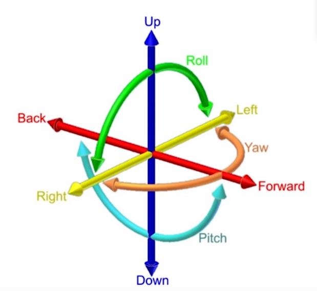
        * Oculus Rift 
            * 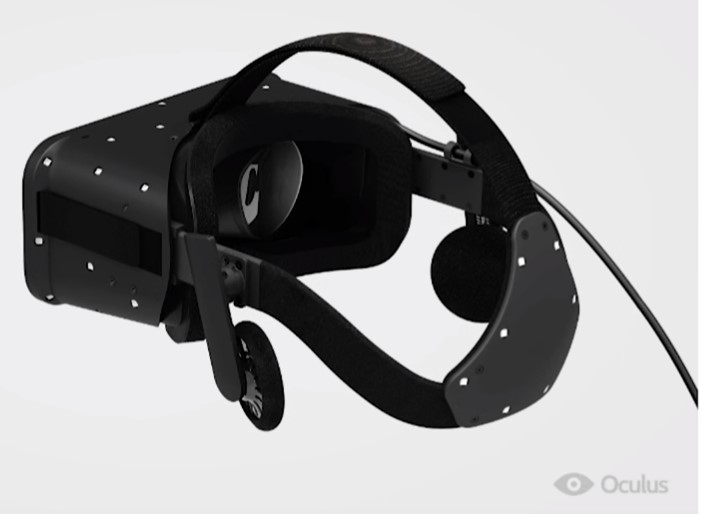
            * Uses a tracking system called **Constellation**
            * The headset contains a great number of infra red LEDs. Each LED is blinking super fast in a specific pattern 
                * 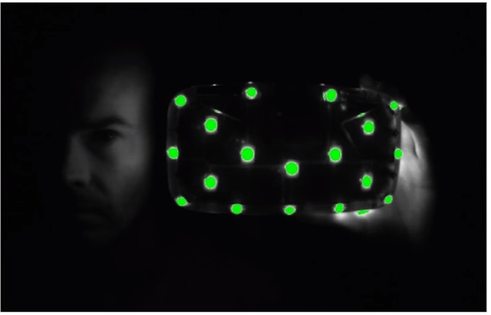
            * Also has a separate camera that you place in your desk. The camera captures the light patterns and a computer program builds up a model of the light positions
                * 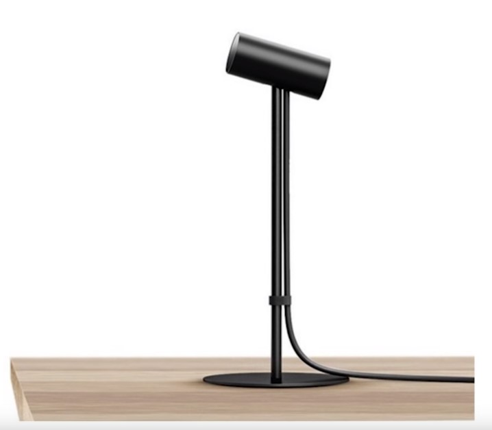
                * That then tries to fit a 3D model of the rift onto the 2d model of the camera
                    * * 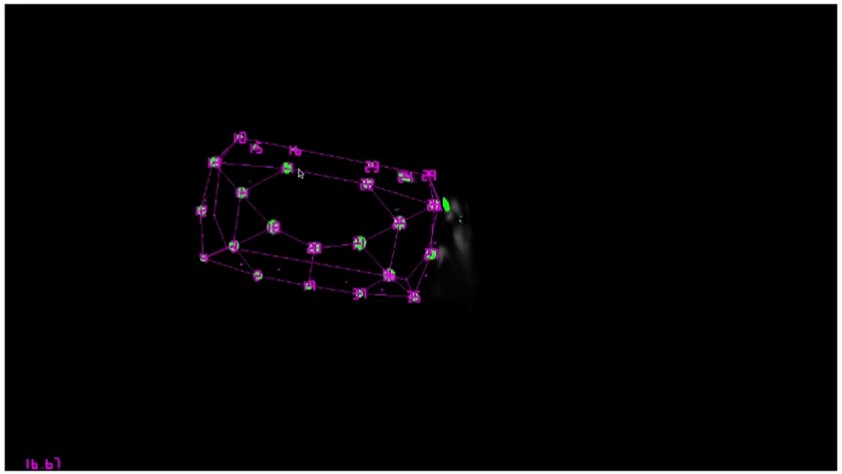
                * Based on this 3d model, and measurements from an internal IMU it calculates your head position
                * This model is cheap and has decent results, and that is why Oculus is doing it
        * HTC Vive (HTC + Valve)
            * 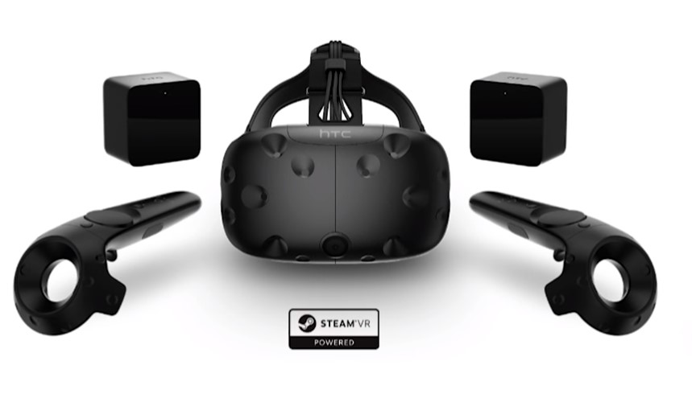
            * Uses a tracking system called **Light House**
            * Unlike the Oculus Rift, it uses infra red laser
                * It works by measuring the time it takes for a laser to swipe horizontally and vertically across a fast photo sensor.
                * 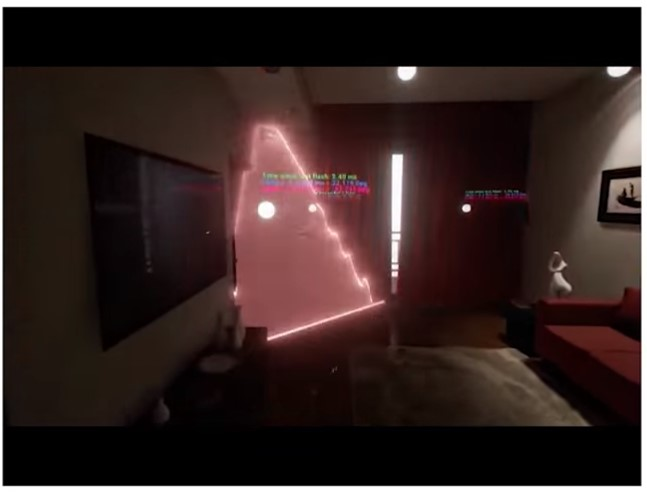
                * 
                    * It is a similar principal to how ships navigates using time measurements between light house flashes (hence the name light house)
                * 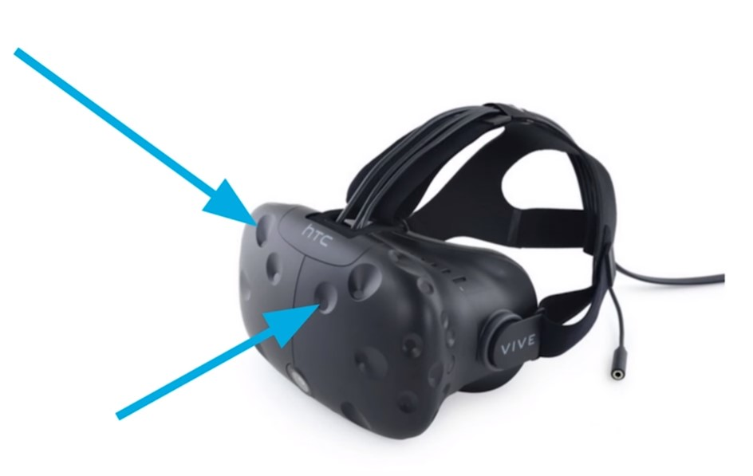
                    *  Both the Vive head set and controllers are covered with little circular indentions for the photo sensors
                * 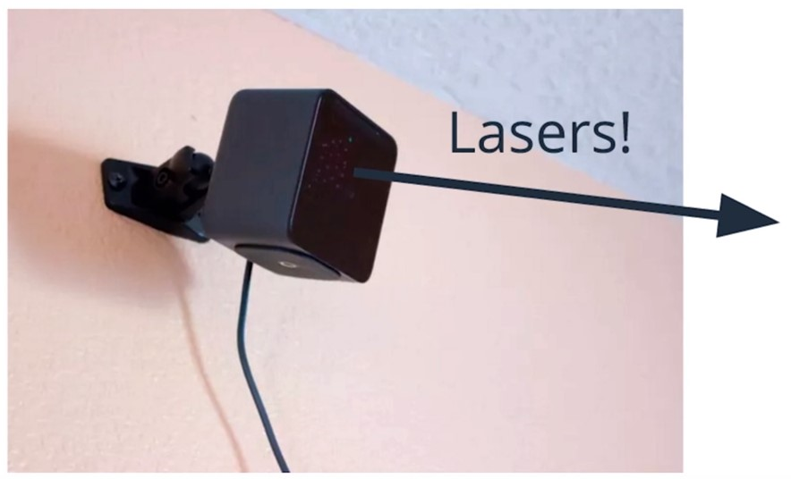
                    * A Vive base station is constantly swiping the room with a laser that hits the photo sensors. The swipe times are used to determine their positions in space. It uses this data and combines with readings from a embedded IMU to determine where your head and hands are located

* Mobile vs Desktop VR
    * Mobile VR uses the phones IMU.
        * This only leads us to 3DOF (only head rotation)
    * No wires needed
    * Less power full in terms of graphical performance
    * Desktop VR gets full 6 DOF tracking
        * Long cables from the headset to the PC
        * More computing power (better visual quality)
    * Desktop VR generally have hand controllers

* VR Development Platforms
    * Their are two primary ways of rendering 3d environments 
        * Write code
        * Use a graphical based environment 
        * Or a combination of both
    * Unity Game Engine
        * Makes it easier to develop games
        * The engine provides
            * 3D rendering 
            * Physics
            * Sounds
            * Scripting 
            * Animation
            * Asset Management 
            * And more...
    * Other game engines
        * Unreal Engine
        * Cryengine
        * Lumberyard
        * etc...
    * Could also go native with OpenGL, Microsoft DirectX, etc..
    * WebVR: Not ready, but good prospect

* Lesson Review
    * What is DoF?
        * DoF stands for degrees of freedom and deals with how accurately the VR system can track you.
    * What is the difference between 3DoF and 6DoF?
        * 3DoF tracking will track how the headset is rotated, so it will know where we’re looking. Most mobile VR platforms use 3DoF tracking. A 6DoF headset will track rotation PLUS position. It will know where we’re looking and where we are in the world. This is how high end VR systems, like the HTC Vive and Oculus Rift, allow you to move around the room.
    * How does 3DoF tracking track our rotation?
        * Inertial Measurement Units (IMUs) are used to track the rotation. IMUs use a gyroscope, accelerometer and a magnetometer to detect rotations. All modern 3DoF tracking uses an IMU.
    * How does 6DoF tracking work?
        * There are many different ways to accomplish 6DoF tracking.
        * The Oculus Rift uses a large number of LEDs and external cameras that build a model and then it tries to fit a 3D model of the headset with the 2D model it sees of the camera. Then it uses information from an internal IMU to calculate head position.
        * The HTC Vive uses infrared lasers to measure the time it takes to sweep vertically and horizontally across a photo sensor. It uses the data it gets and an internal IMU to determine where your head and hands are located.
    * What are the key differences between mobile and desktop VR?
        * Mobile VR uses IMU tracking, so it only has 3DoF tracking. It can only track your head’s rotation - not it’s position. It’s also “untethered”, meaning that there’s no wires connecting your headset to a computer. You can use it anywhere. It has less powerful graphics and is powered by a battery.
        * Desktop VR uses 6DoF tracking and is typically tethered. It’s plugged into a computer and uses the computer to do the graphics work and to get its power. The graphics are generally more impressive. Most desktop VR headsets also come with hand controllers that allow for more interactivity and a more immersive experience.
    * How can we develop for VR?
        * Generally, developing for VR requires writing some code, using an editor, or a combination of both. We’ll be doing both over the course of this program.
        * For our editor, we’ll be using Unity, a popular game engine. A game engine is a software development framework that makes it easier to develop games. Game engines typically provide 3D rendering, physics, sound, scripting, animation, asset management, and more. This will enable us to develop quickly and learn.
        * Other popular game engines are: Unreal Engine, Cryengine, Lumberyard and more.
        * You can also use native development tools like OpenGL and Microsoft DirectX. These options offer more flexibility, but typically have much longer development times and writing more code.
        * WebVR is also an option. However, it’s not yet good enough for production apps.

### Lesson 4: Hello World?

* Create a new project using Unity

* In the center of the screen you have the `Scene`
    * If you right click and hold inside the `Scene`, you can navigate it by using a,s,d,w
    * 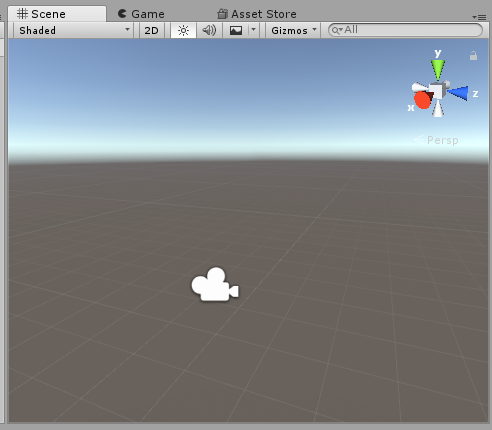
* On the left side you have Hierarchy 
    * You can see a list of `Game Objects` we have added to our scene
        * A `Game Object` is Unity`s way of representing anything that can affect our scene
            * A light
            * A cube
            * A complex character
            * Main camera
        * 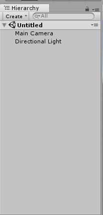
* Each Game Object can have many `Components` (which is the window in the right)
    * 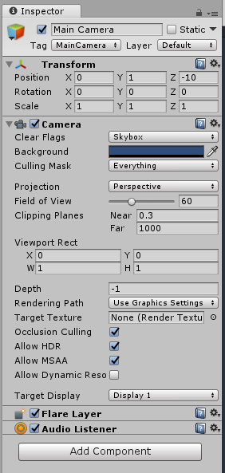
    * Each `Component` has a list of properties that we can change. For example, the `Transform` component can be manipulated by using the buttons on the top left corner.
        * 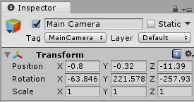
        * 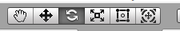
* We can notice our changes to the `Transform` component not only reflect in the `Scene` it self, but also on something called the `Game` view.
    * 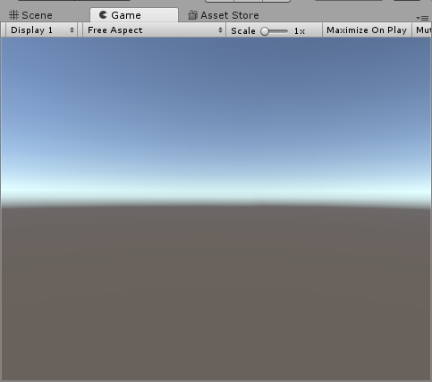
        * That is the view the users will see when you finally publish your app 
    * You can drag the `Game` view right next to the `Scene` view
        * 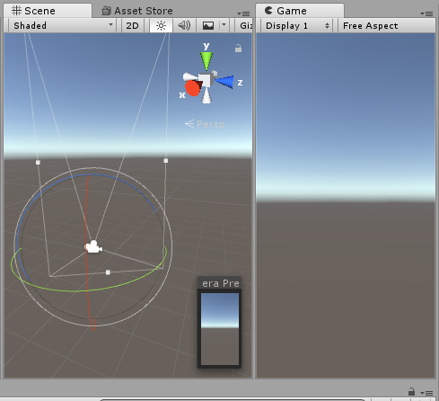 
* Unity also provides a set of layouts that users can use (check the top right corner). We will stick with the `Default` layout for now
    * 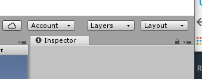 
* On the bottom of the screen we can see the `Project` option. This is the place where we can access any file we save or import to our project.
    * This includes code we write, 3d models we build, or full out scenes.
    * 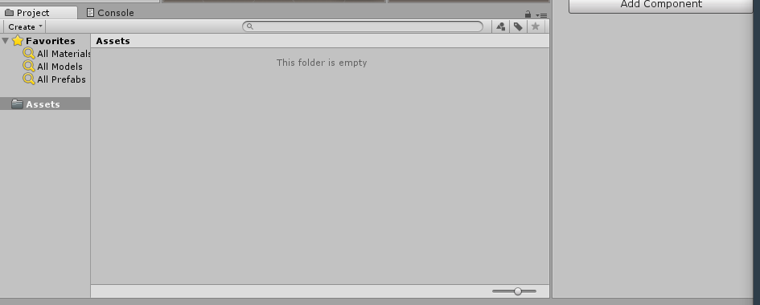 
    * Lets save our current scene inside the `Assets` folder
        * 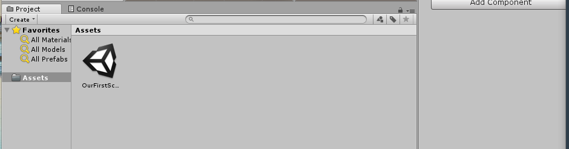  
* Recommended Reading
    * [Unity Manual: Scene View navigation](https://docs.unity3d.com/Manual/SceneViewNavigation.html)
    * [Unity Manual: Customizing Your Workspace](https://docs.unity3d.com/Manual/CustomizingYourWorkspace.html)
* Additional Reading
    * [Unity Manual: The Project Window](https://docs.unity3d.com/Manual/ProjectView.html)
    * [Unity Manual: The Scene View](https://docs.unity3d.com/Manual/UsingTheSceneView.html)
    * [Unity Manual: The Game view](https://docs.unity3d.com/Manual/GameView.html)
    * [Unity Manual: The Hierarchy window](https://docs.unity3d.com/Manual/Hierarchy.html)
    * [Unity Manual: The Inspector window](https://docs.unity3d.com/Manual/UsingTheInspector.html)
* Extra notes based on Readings
    * **Gizmo** or **Scene Gizmo**: A graphic overlay associated with a `GameObject` in a `Scene`, and displayed in the `Scene View`. Built-in scene tools such as the move tool are Gizmos, and you can create custom Gizmos using textures or scripting. Some Gizmos are only drawn when the GameObject is selected, while other Gizmos are drawn by the Editor regardless of which GameObjects are selected

## VR Scenes and Objects

## Lesson 2: Game Objects

* Primitives
    * Cubes
    * Spheres 
    * Cylinders
    * Cones 
    * Planes

* To create a primitive you click on `GameObject` -> `3D Object` on the top menu. 
* 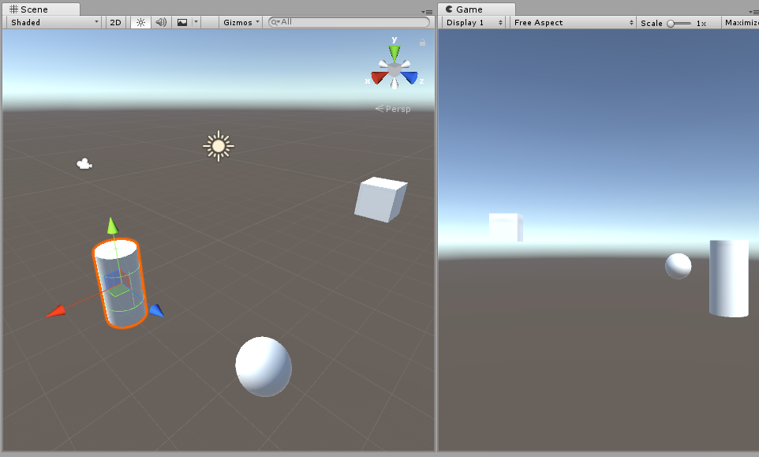 

* Unity does support importing 3D models from other application. However, it is not a 3D modelling/texturing/character rigging tool it self. This makes it way easier to learn 
    * Rigging a 3D model creates a skeleton or a frame for that model. By rigging a 3D model you can make it move around and perform different actions. Otherwise, the model would be static and remain in the position that it was when the animator created it.
    * Unity is a master at assembling 3D Scenes
    * Maya, 3D Studio, Blender, etc..
        * We will use those tools for 3D modeling

* 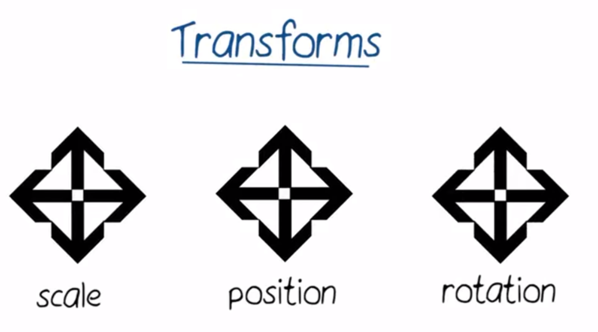 

* Transform Hierarchie
    * 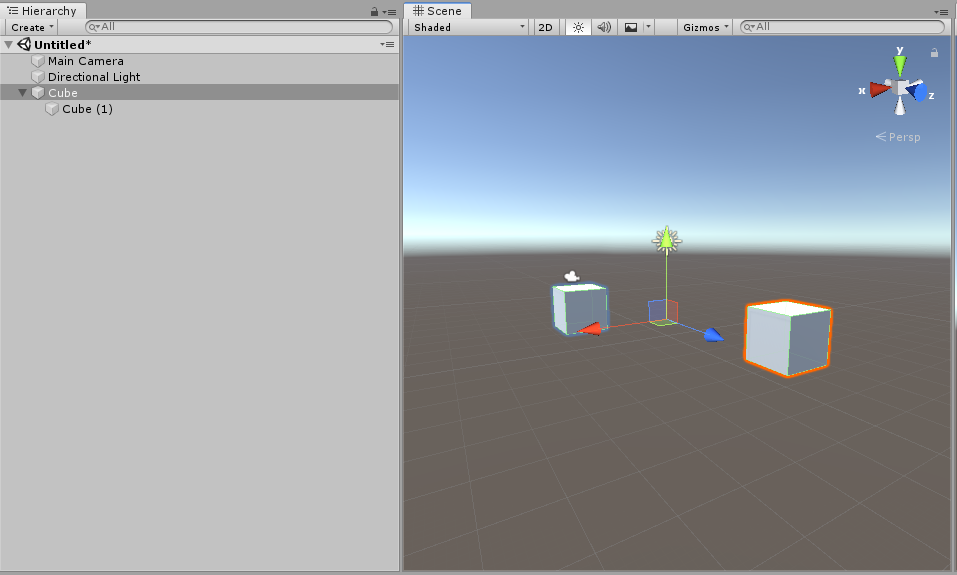
    * If you drag one `GameObject` inside another one, this will generate a unified transform. Whenever you change the scale, position or rotation of the parent object, all its chields will update

    * Unity uses matrices to quickly process the parent/child transform hierarchies. This is a really good idea because matrix operations are extremely fast on modern computers.

* Lesson Review

    * What are VR scenes made of?
        * Everything you see in a VR scene is made of something called meshes. Meshes are made of triangles which are made of points. We use triangles to represent 3D objects because it’s fast, easy, and computers are optimized for them.
            * A polygon mesh is a collection of vertices, edges and faces that defines the shape of a polyhedral object in 3D computer graphics and solid modeling.
        * Points / Vertices 
        * Edges
        * Connect the Points to the Edges using a straight line in order to generate a polygon / poly (triangles in the case of Unity)
            * Polygons are 2-dimensional shapes. They are made of **straight lines**, and the shape is "closed" (all the lines connect up).
        * Connect the Triangles and you will have a Mesh/Polygonal Mesh
    * What are Primitives and how can I make some in Unity?
        * **Primitives are very basic 3D meshes**. Some examples of them include cubes, planes, spheres, and cylinders. There are a couple of different ways to make a primitive object in Unity. One way is to go to GameObject > 3D Object and then select the object you wish to create.
    * Does Unity support creating more complicated models?
        * Unity focuses on rendering 3D scenes and does NOT support creating more complex models. You’d have to use a separate specialized program like Blender or Maya to create complex models. You can also get 3D models online (from a site like Poly) or through the Unity Asset store.
    * How can I bring a 3D object into my scene?
        * To get the model from your computer into Unity, you can go to Assets > Import New Asset and navigate to where the model is on your computer. Once the model is in your project. Drag the 3D object from the Project window into the hierarchy. Use the move tool arrows to position the object where you’d like it to be.
    * What are transforms?
        * Every `GameObject` in Unity has a Transform component. This is the component that tracks the object’s position, rotation, and scale. You can change the properties by changing the values in the Inspector or by using the move, rotate, or scale tools in the upper left corner of Unity.
    * What are transform hierarchies and how can I create one?

## Lesson 3: Materials

* Materials are good for coloring, shading and texture

* To create a `Material` navigate to the project folder, more specifically to the `Assets` folder.
    * After that, click `Create` on the top left corner, and then select `Material`

* This `Material` represents a **shader**
    Shader: the production of appropriate levels of light, darkness, and color within an image
    * `Albedo` parameter defines how light changes when it gets reflected by a surface
        * Lets say white light hits my shirt and then is reflected blue. That is the `Albedo` of the shirt material
        * The `Albedo` is the materials main color

* `Textures` are images that get stretched around `Meshes`
    * They are used to adjust color, transparency, depth, shininess, metalness, light emission and many more
    * 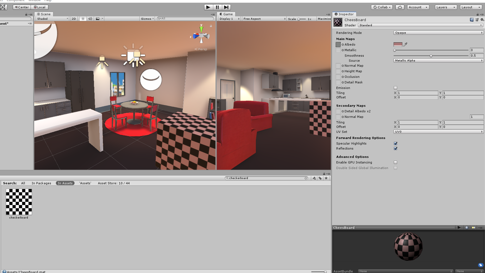

* To create a `Shader` click `Create`->`Shader`->`Standard Surface Shader`
    * We can change the `Albedo` property of the `Shader` to be always green: `o.Albedo = float3(0, 1, 0);`
    * After that, we can create a new `Material` and apply the `Shader`
    * 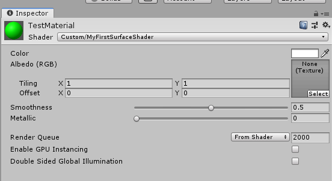
        * `float3(0, abs(sin(_Time.z)), 0);`
            * `_Time.z`: number of seconds passed after you pressed play
            * `sin`: will give us a number from -1 and 1
            * `abs`: from 1 to 0
    
    * Unity’s Standard Shader attempts to light objects in a physically accurate way. This technique is called **Physically-Based Rendering** or PBR for short. Instead of defining how an object looks in one lighting environment, you specify the properties of the object, for example, how metal or plastic it is.

    * Then, the shader computes its shading based on those factors. In practice, this works incredibly well to produce realistic 3D objects across a variety of lighting conditions. The big problem is that it is often computationally expensive.

    * For mobile VR, it is unlikely we will be able to hit our performance targets if we use the Standard Shader. So, we will be using simpler and less computationally expensive shaders for this course.

    * A super fast shader is the `Mobile` -> `Unlit`, but it is not attractive
        * Another option is to use `Mobile` -> `Diffuse`, it will look more like the standard shader
            * This is much much faster compared to the `Standard Shader`
        * 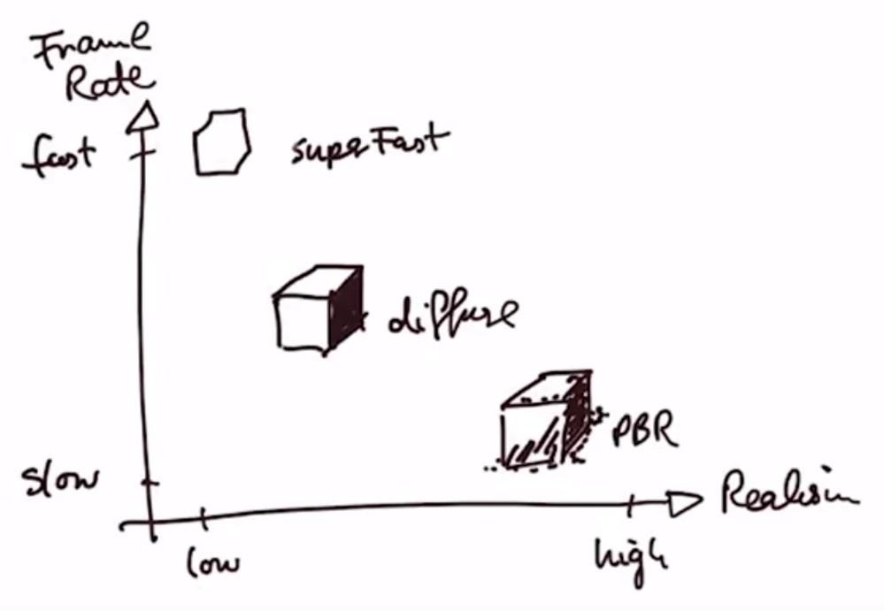

* Lesson Review

    * What are materials?
        * Materials are what we use to color and shade our objects. They consist of a shader and its settings. Without them, we wouldn’t be able to see objects in our scene at all!
    
    * How can I create and assign materials to an object?
        * To create a material, go to the Project window and click Create > Material. There are a couple different ways you can assign a material to an object. Find the material in the Project window and click and drag the material onto an object in the Scene. Click on an object in the Hierarchy, so you can see the details in the inspector. Click and drag the material and drop it in the inspector.
    
    * What are textures and how can we assign them to an object.
        * Textures are images that get stretched around meshes. They can adjust color, transparency, depth, shininess, metalness, light emission, etc. To assign a texture to an object, find the object’s material in the Project window and click on it, so you can see its properties in the Inspector window. Search for your image in the Project window. Click and drag the image into the small box to the left of the “Albedo” setting in the object’s material.

    * What are shaders?
        * Shaders are written in High Level Shader Language (HLSL). Shaders are essentially the code behind how an object is rendered.
        
        * For mobile VR, we’ll want to use simple shaders because the Standard Unity shaders will be too computationally expensive. To change the shader type of a material, click on the material in the Project window. In the Inspector, toward the top, you’ll see a dropdown for Shader.
    
    * What are some simple shaders?
        * Mobile > Unlit (Supports Lightmap) - This super fast shader supports lightmaps, but doesn’t get any realtime lighting.
        * Mobile > Diffuse - This is a fast shader, that does get some lighting information. The main difference between this shader and the standard shader, is that this one is much faster.
    
    * What makes up a model?
        * Models are made up of materials, textures and meshes.

## Lesson 4: Animations

* Click on `Window` -> `Animation` -> `Animation` to open the animation screen (you can drag it if you want)
* In order to create an animation, you first need to select an object in the `Hierarchy`
* Once we do that, the `Animation` window will turn to a timeline also known as the `Dopesheet`.
    * On the left we can click the `Add Property` button and we can animate any of this properties (example: the transform component associated to the object)
    * 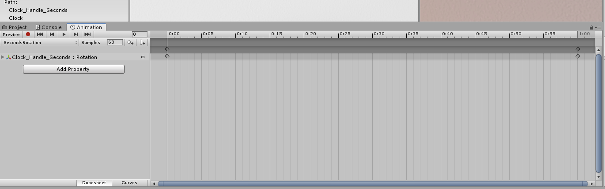
* You can also see some diamonds on 0 seconds and 1 second. These diamonds represent keyframes
    * 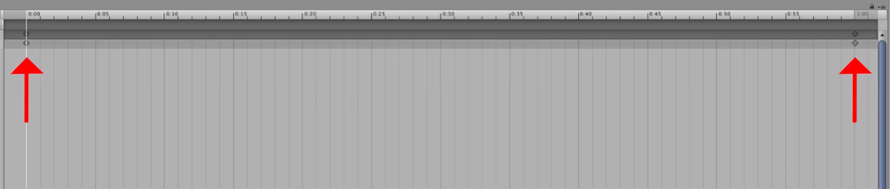  
        * Key frames are points in our animation where we can update our properties
        * We can create new `Keyframes` by clicking anywhere in the timeline.
    * By dragging the time line (white line), you can change the property value associated to the `Keyframe`.
    * How is the animation build based on those key frames (example: 360 rotation)
        * Interpolation, Smoothing and Averaging
            * By definition, **interpolation is the process of constructing new data points within the range of the known data points.**
            * In our case, the known data points are the keyframes we specify. The new data points are calculated by averaging and smoothing values in between.
            * In VR and computer graphics in general, interpolation is used quite regularly to speed up the process of creating beautiful scenes.
    * 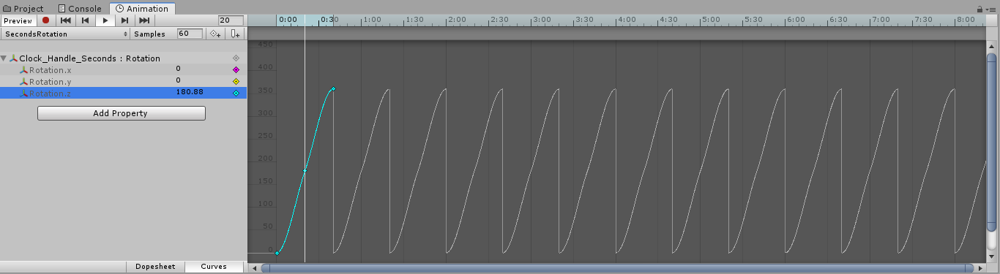
        * If you click the `Curve` button on the bottom of the screen, you will be able to see the interpolation that is done to generate a new `Rotation.z` value.  
        * Right now this graph has a curve, but we can make it linear by clicking on both ends of the line and selecting `Both Tangents` -> `Linear`
        * To learn more about the Animation Curves, check this link [here](https://docs.unity3d.com/Manual/animeditor-AnimationCurves.html)
    * 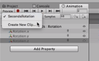
        * By clicking on the animation, we can create another animation associated to this `Game Object`
    * Inside the `Animations` folder you will notice a `Clock_Handle_Seconds`. As you can probably guess from the filename Clock_Handle_Seconds and its extension .controller, that file controls all the animations associated with the Clock_Handle_Seconds.
        * Both our animations clips that we created are accessible through the controller and it controls several properties of the animations, such as when they are played, how to transition between animations, and how to blend animations together, to name a few.
    * 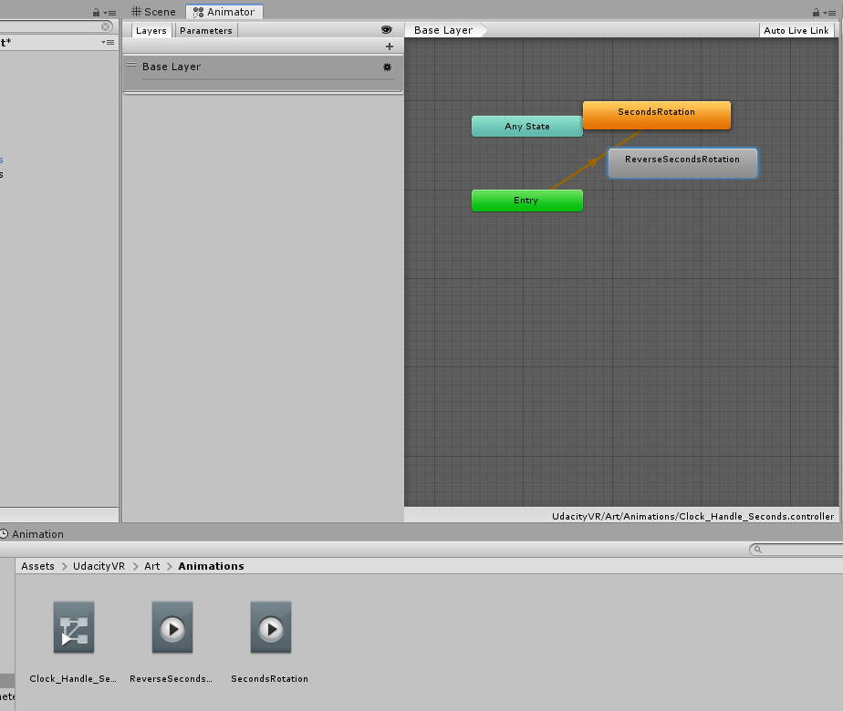
        * To move around we can do `Alt + Left Click`
        * Each block is called a `State` which are all part of a gigantic `State Machine`
        * 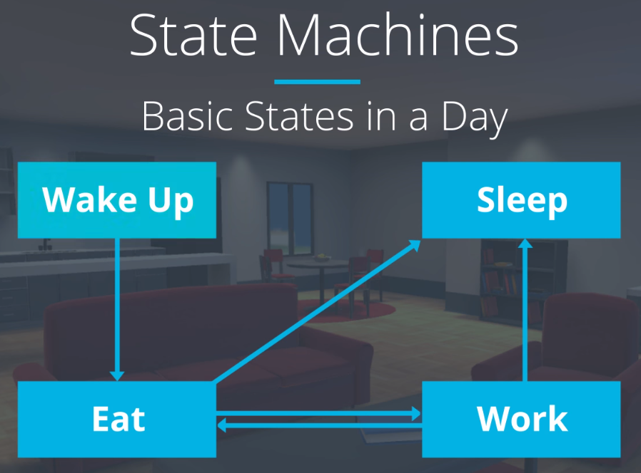
            * A `State Machine` is a system that connects many `States` together via transitions.
        * At any given point, our clock hand can be in one state, and that state represents which animation we are currently doing.
        * The `Entry` and `Exit` states are special `States` that represent when our machine starts up and ends.
        * The `Any State` is a special `State` that represent all animation states.
        * In order to transition to a different state, just right click on a `State` box and select `Make transition`
        * Read more  about `Animation transitions` [here](https://docs.unity3d.com/Manual/class-Transition.html)
    * To control our animations, we will also use `Parameters`
        * 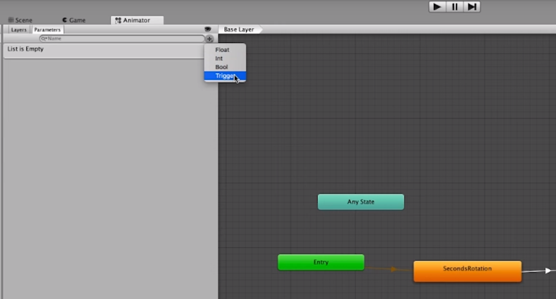
            * We will use a `Trigger`, a bool that resets back to False immediately after transition occurred
            * 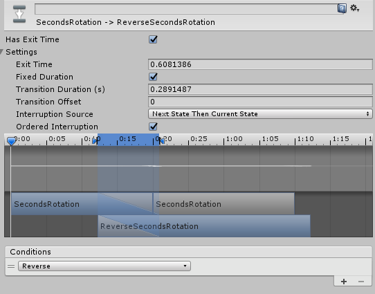
            * We can un-check `Has exit time` to remove the transition between the two `States`
    * To control animations without the animation window, we can use C# scripts.
        * We can drag an drop a script as a `Game Object` `Component`.
        * Example of a animator script code
            * ```csharp
                using UnityEngine;
                using System.Collections;

                /// <summary>
                /// The TriggerAnimation class activates a transition whenever the Cardboard button is pressed (or the screen touched).
                /// </summary>
                public class TriggerAnimation : MonoBehaviour
                {
                    [Tooltip ("The name of the Animator trigger parameter")]
                    public string animationName;
                    [Tooltip ("The Animator component on this gameobject")]
                    public Animator stateMachine;

                    void Update ()
                    {
                        // If the player pressed the cardboard button (or touched the screen), set the trigger parameter to active (until it has been used in a transition)
                        if (Input.GetMouseButtonDown (0)) {
                            stateMachine.SetTrigger (animationName);
                        }
                    }
                }
                ```

* Lesson Review

    * How can I create an animation?
        * Select an object in the hierarchy. In the Animation window, click Create. Choose a name for your animation and save it to an appropriate folder in your project. Click Add Property and select a property you want to animate.
        * The timeline (also known as a dopesheet) contains all of the frames of our animations. Keyframes are indicated by diamond shapes in the timeline and are key points in our animation where we can update properties. To create new keyframes, double click on the timeline. You only need to define a few keyframes to create smooth animations. The points in between keyframes are created using interpolation, averaging and smoothing.
    
    * What is the difference between the Play button in the Animation window and the Play button at the top of our Unity editor?
        * Clicking the Play button in the Animation window, runs only the animation. The Play button in the top of the editor will play our entire scene.
    
    * Our animations might not loop seamlessly. It tends to lag a bit at the start or end of our animation. How can we fix that?
        * This can happen if the tangents of our animation are not set to be linear. To resolve this, in the animation window, there are two tabs. One for “Dopesheet”, which is the one that we start on by default. The other is “Curves”. Click on Curves and you’ll see a line that represents our animation. Click on the first keyframe, and set “Both Tangents” to “Linear”. Do this for the last keyframe as well.
        * Tip: If you’re working with a larger animation with more keyframes, you may want to do this with all your keyframes.
    
    * What are animation controllers?
        * Animation controllers are the files that controls all the animations associated with a given object. These controllers control properties of the animations like when an animation is played, how to transition between animations and blending animations together.
    
    * What is the difference between the Animator window and the Animation window?
        * The Animator window is what controls all our animations for a given object. The Animation window lets us see and modify a specific, individual animation.
    
    * What is the Mechanim State Machine?
        * In the Animator window, you’ll see several boxes. By default, an animator controller has Entry, Any State, and Exit states. The Entry and Exit states are used for when the object starts up and ends, respectively. The Any State is a special state that represents all other animation states. There will also be one for each animation on the object. The Mechanim state machine is what connects the various states together and handles transitions between animations, or “states”. At any point, our object can only be in one state and playing one animation.
    
    * How do I transition between states in the Animator (Mechanim State Machine)?
        * Right click on a state and select Make Transition. Then click on another state. This will create a transition (represented by an arrow) from one state to another.
    
    * How do I control states in the Animator?
        * e use parameters to control the various states in our Animator. To create a parameter, click on the Parameter tab in the Animator window. Click the plus icon, then select the type of parameter you’d like to create. There are options for floats (decimals), int (whole numbers), bool (true or false), and trigger (a bool that resets back to false immediately after the transition occurred).
    
    * I have my parameter setup, but how do I actually use it?
        * In the Animator window, click on the transition (arrow) you want to use the parameter. Then in the Inspector window, you will add it to the “Conditions” by clicking the plus icon.
    
    * I want my transitions to happen immediately. How can I adjust when my parameters take effect?
        * By default, Unity assumes that an animation should complete before transitioning to another state or animation. This is a concept called “Exit Time”. To change this, click on the transition arrow in the Animator window. Uncheck “Has Exit Time”.
    
    * Tip: If you’re still noticing a little jump when shifting between states, it’s likely due to the animation clips being of different lengths. To avoid that jump, make your animations the same length.

    * Note: This lesson didn’t show you how to change the animations with your own scripts. That will be included in an upcoming lesson.

## Lesson 5: Cameras

* To view a `Scene` in Unity we will use a `Camera` `Game Object`.
* Whenever you create a new `Scene` in Unity, it will be populated with a `Main Camera`
    * If you check the `Inspector` you should see a `Camera` component.
    * `Clear Flags` are a property that indicates what the camera should render if, for a given pixel on our screen, the camera does not see a 3D object.
        * Sort of a control for the background.
        * `Skybox`: just the plain old sky
            * You can replicate that by creating a `Material` and using a shader called `Skybox/Procedural`
            * We can add a `Skybox` component to the `Game Object` and inject our brand new `Material` to it.
            * 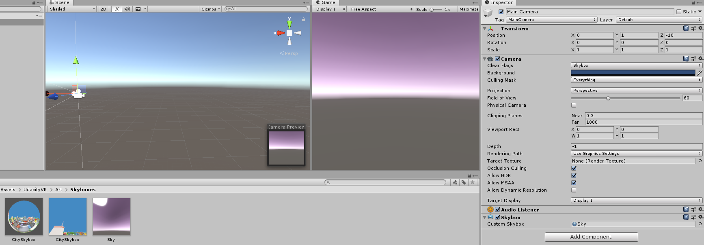 
    * `Clear Flags` options:
        * `Solid Color`: Sets the background to a single color which we can change with the background property
        * `Depth only` option is useful in cases where we have multiple cameras. For example, in shooting mixed reality footage
            * 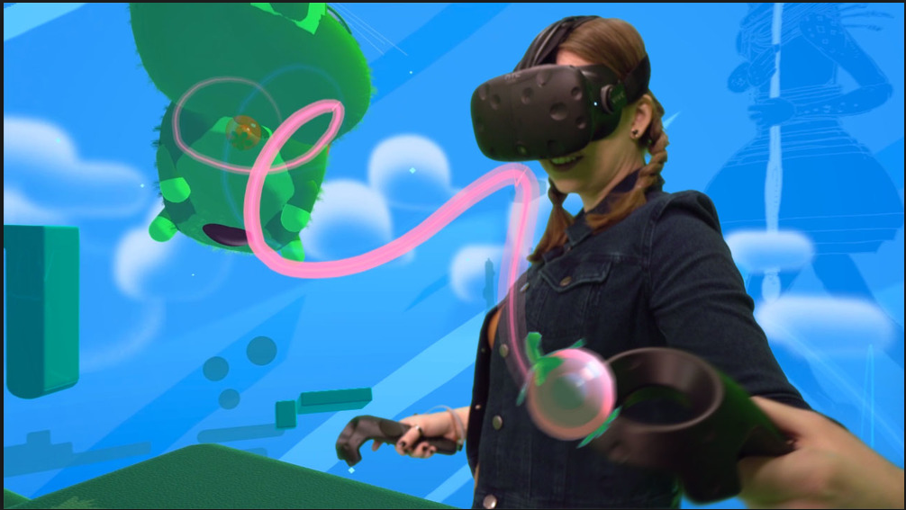 
            * In that scenario, we need one virtual camera to capture foreground content without any background.
        * `Don't Clear`:  Never use this for VR. This mode uses the previous image from the previous frame as the background for the next image. Results in a very disorienting experience
    * `Culling Mask`
        * The culling mask property tells the camera which layers of the scene it should render in the image. A layer is simply a group that we can place any `Game Object` into.
        * 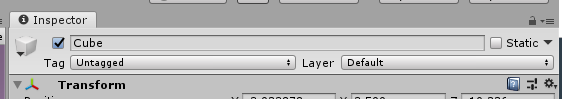 
            * Whenever you create a `Game Object` that will be placed in the `Default` layer. We can create our own layers by clicking `Add layer`.
        * 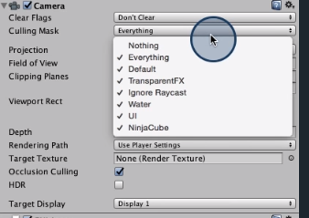
            * If we remove the `NinjaCube` layer from the list, the `Cube` won't be rendered in the Game View (but it will show in the Scene View).
    * The next property on the camera is titled `Projection`. This refers to the way we capture 3D space and represent it on a 2D screen. Unity provides two options: `Perspective` and `Orthographic`.
        * `Perspective` allows the camera to act similarly to a pinhole camera in which we take into account the fact that objects closer to the camera should appear larger, just like in real life.
            * One of the key selling points of virtual reality is that it is a medium that allows us to appreciate the scale and depth of a scene. For that reason, we want to simulate the way we perceive depth in real-life, which is why we use perspective camera projection in VR.
        * `Orthographic`, on the other hand, effectively renders objects based on their size and not based on how close they are.
    * `Field of View` / `Size`
        * This controls the vertical angle that the camera will capture with a perspective projection. Based on this value and the screen size, Unity will calculate the horizontal field of view. By default, Unity sets this field of view to 60 degrees.
    * `Viewport Rect`: 
        * Allows us to control where on the screen our camera image is rendered. Normally, a camera renders to the whole screen width. But with this property, we can assign what percentage of the screen to use. This will be very useful in creating a virtual reality camera system (two images at the same time / two cameras).
    * `Clipping Planes`:
        * Primarily used for efficiency purposes. Unity defines two planes in front of the camera called the near and far clipping planes. Anything in between those planes will be rendered and anything outside of it wont. This is an optimization called FRSs Num Calling, and the close the near and far places are to each other, the better performance you will achieve.
    * Read more [here](https://docs.unity3d.com/Manual/class-Camera.html)
    
* 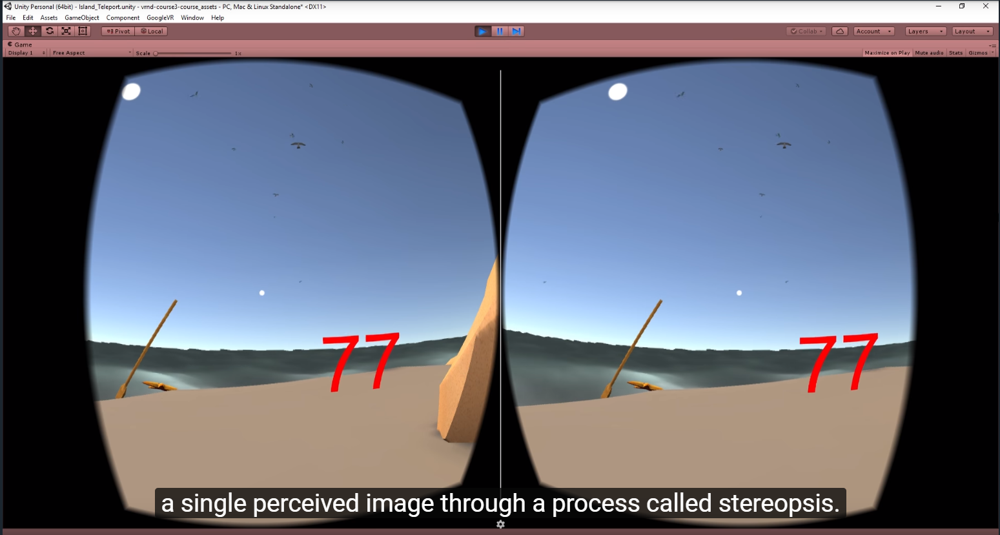 
    * For VR, we need to generate two slightly offset images, one for each eye. When viewed through an HMD (Head-mounted display), our brain is then able to magically fuse these images into a single perceived image through a process called stereopsis.
        * Stereopsis is a term that is most often used to refer to the perception of depth and 3-dimensional structure obtained on the basis of visual information deriving from two eyes by individuals with normally developed binocular vision.
    * In order to do that, we need 2 cameras in Unity (one for each eye)
        * We need to offset the cameras based on the distance between the center of the two lenses on our HMD. This distance is called the lens separation distance or LSD for short. The LSD is tied very closely to the interpupillary distance or IPD, which is the physical distance between the centers of our eyes. IPD generally range anywhere from 52 to 78 millimeters.

* There are amazing VR SDKs that are able to get a Unity Scene an enable it for VR.
    * Google VR
    * Steam VR
    * Oculus 

* You can create your own VR look and feel by creating two cameras and offsetting them with the LSD/2 value.
    * 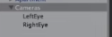

* To work with head rotation, we will need to create a C# script and add this as a component of the camera `Game Object`
    * 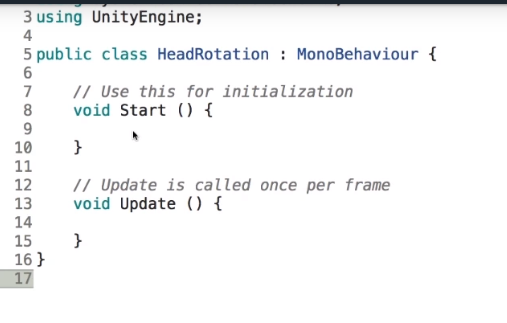 
        * `Start` will run as soon as your game starts
        * `Update` will be called every single time a frame is rendered onto your VR headset. We will need to use both these methods to access the gyro, which is a sensor in our phones that tells us how our phone is oriented.
    *  
        * It is important to note that the Google SDK actually uses all IMU sensors (gyro, compass, accelerometer) to determine the head tracking.

* At this point, we now have a basic VR camera system that we can throw into any VR scene. However, if you look at your app versus a normal Google Cardboard app, you will notice that we have a lot of black space and the images for each eye are not perfect rectangles. 
    * 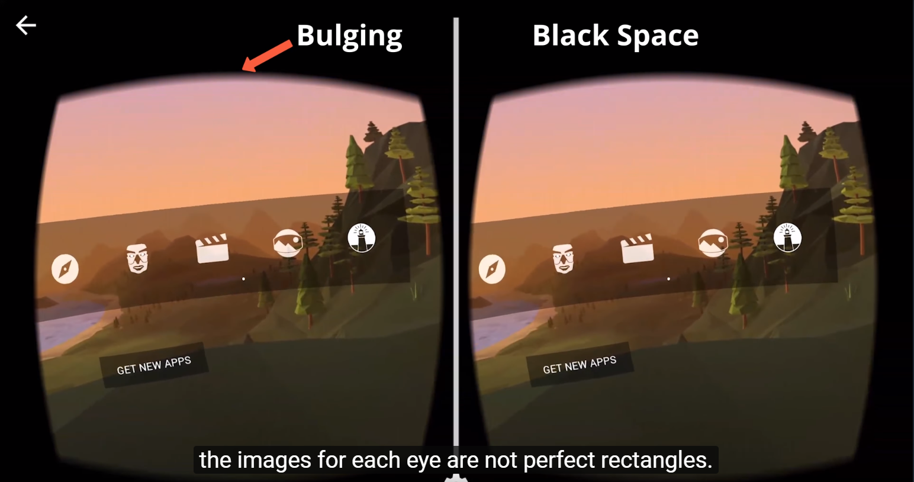 
    * The reason for that is because Google is trying to combat two problems when you view a screen through a lens, which you do when you viewing VR.
        * One of them is pin **cushion distortion** which bulges (dilates) the images we see through the lenses because they're curved 
            * 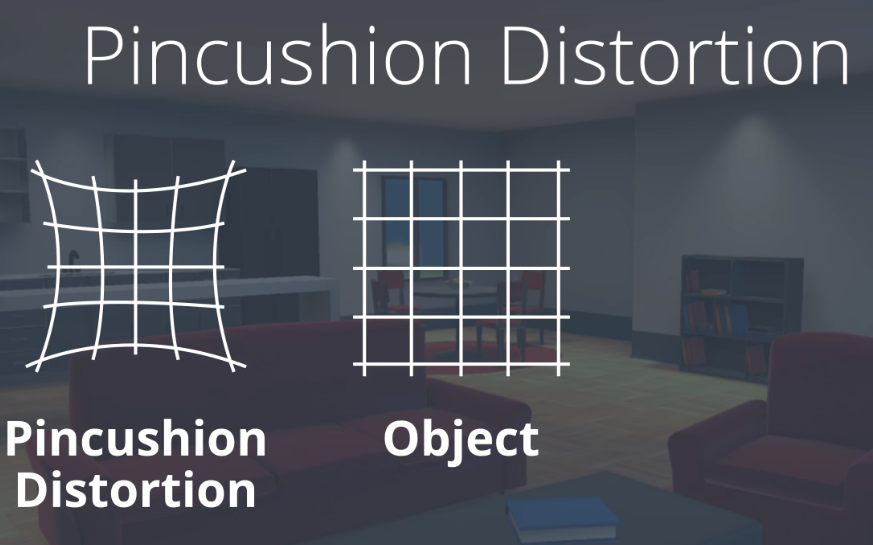
        * Google solves this issue by using a technic called **barrel distortion** which warps (bent) images on the screen but results in the effects of push **cushion distortion** being negated when viewed through a headset.
            * 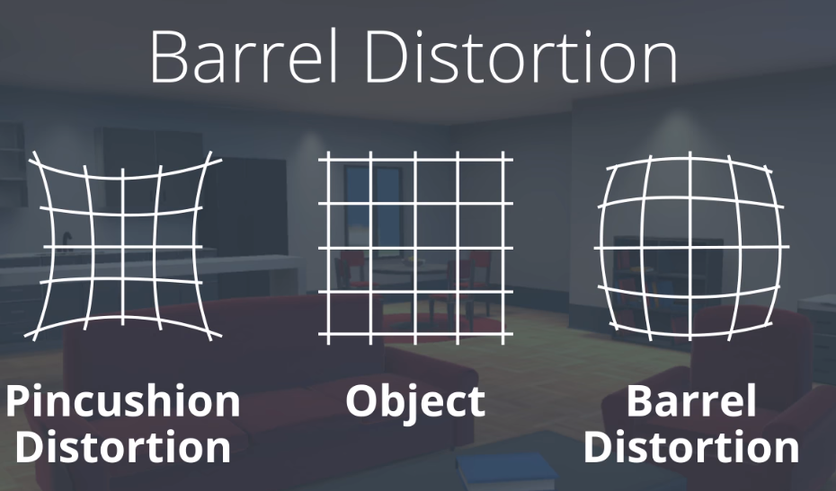 
    * The second problem that arises from viewing a screen through a lens is **chromatic aberration**. This problem results in colors on the perimeter of the lens shifting out in a rainbow-like band, similar to how a prism breaks light into a rainbow. Just like **pin cushion distortion**, the colors on the edges of an image can be warped (bent) so that when viewed through a headset, the chromatic aberration is cancelled out.
        * 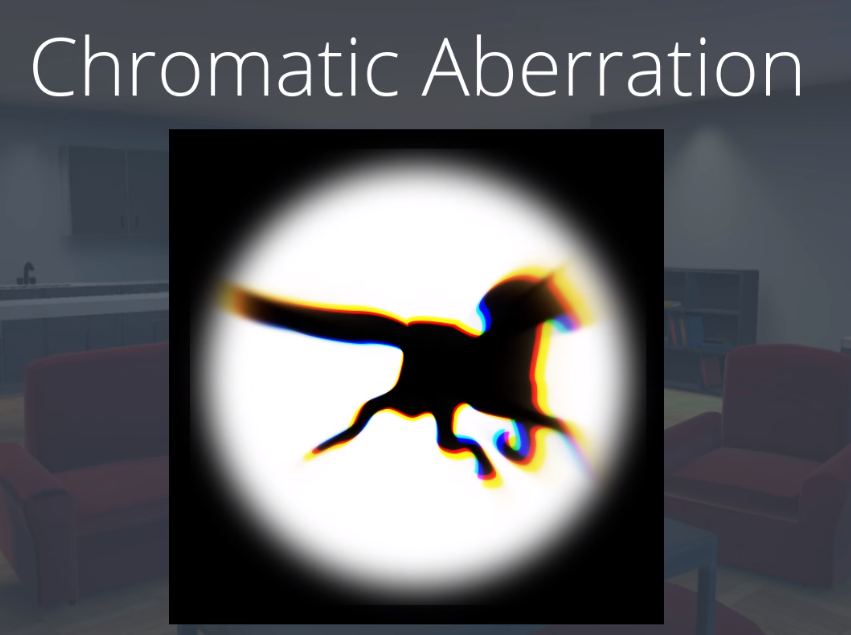
        * 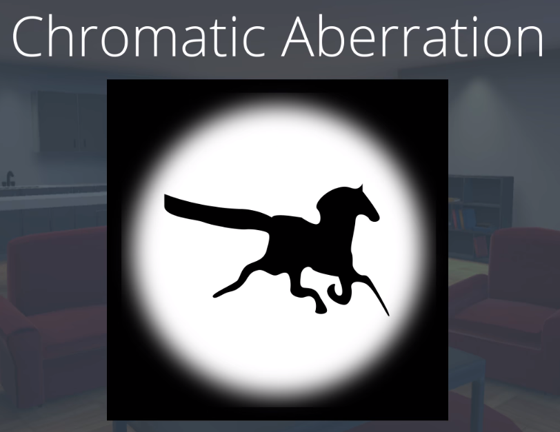
    * That is how the image Google creates is different from the one that we just created in our simple system.

* Enabling VR Support and Adding Cardboard SDK
    * Assuming the [Google VR SDK](https://developers.google.com/vr/develop/unity/get-started-android) for Unity asset has been imported into your project, you can enable VR with just a few clicks!

    * Note: The course assets for this lesson have GoogleVR Unity SDK included so there should be no need to download and import it into your Unity project.

    * To enable VR, simply go to the Unity menu Edit > Project Settings > Player to open the Player Settings in the Inspector:
        * 
    * Next, under the XR Settings section for the platform you are targeting, i.e. iOS or Android:
        1. Check the Virtual Reality Supported checkbox.
        2. Click the plus symbol and add Cardboard.
    
    * Note: If there are other SDKs already added, you can delete them using the minus symbol.

    * As long as you have a camera in your scene, your project now supports VR!

* Drag & Drop for Added Functionality

    *  One of the neat things about Google VR SDK for Unity is that it has a built-in tool that lets us simulate head rotation and tilt directly in the Unity Game view.

    * To enable this, simply locate the GvrEditorEmulator prefab located in the Assets > GoogleVR > Prefabs folder, drag it into your scene and position it where you would like the camera located. Then make your camera a child of the GvrEditorEmulator in your scene hierachy and ensure the camera's transform is set to default values, i.e. Position and Rotation is 0, 0, 0 and Scale is 1, 1, 1:
        * 
    * Note: If you plan to move your camera during gameplay via code, make sure the camera is tagged MainCamera in the Inspector, as shown in the image above.
    
    * Now, once you enter Game mode, you can use the following controls:
        * To simulate head rotation (rotate around Y axis): Alt + mouse movement.
        * To simulate head tilt (rotate around Z axis): Ctrl + mouse movement.
    
    * Important! In general, the camera should always be nested under a parent gameobject, for example, the GvrEditorEmulator, and have a local position and rotation of 0, 0, 0. To reposition the camera, the parent gameobject should be repositioned and the camera itself should keep its local position and rotation of 0, 0, 0.

* GoogleVR Related Changes affecting Course Assets and Starter Project 

    * Since the videos in this course was recorded, there has been multiple updates to Google VR SDK for Unity. The main changes affecting this course are:
        * The GvrViewerMain prefab you see in the Hierarchy during the videos no longer exist in Google VR SDK for Unity and is now represented by the GvrEditorEmulator prefab.
        * The Main Camera you see in the Hierarchy during the videos will typically be nested as a child of the GvrEditorEmulator prefab.

* Lesson Review

    * What are cameras in Unity?
        * Cameras are a tool in Unity to show the virtual world to our users. Positioning the camera allows us to control and influence what our players see.
    
    * What is the camera’s clear flags property?
        * The `clear flags` property tells our camera what to render if it doesn’t see a 3d object.

            * Skybox is the default setting. It shows what the world looks like around your 3d models. A skybox is another type of material and could be a cityscape, desert, or just the sky.

            * Solid color sets the background to a single color.

            * Depth only is used when there’s multiple cameras, like when creating mixed reality footage.

            * Don’t clear is NEVER used for VR. It uses the image from the previous frame as the background for the next frame. It’s very disorienting in VR.
    
    * How can I create my own skybox?

        * Create a new material. Change the Shader from Standard to Skybox > Procedural. If you wanted to add this skybox to a camera, you’d add a Skybox component to the camera. Then drag the new skybox material to the Skybox component.
    
    * What is the Culling Mask?

        * The culling mask tells the camera which layers (or groups) of the scene it should render. It can be useful when we want to hide parts of our scene until we want them to be seen.
    
    * What’s the difference between Perspective and Orthographic cameras?

        * Perspective cameras work just like real life. Closer objects appear larger, and objects further away appear smaller. This is the one we use for VR cameras.

        * Orthographic cameras render objects based on their size and not how close they are. A pencil that’s really close to the camera would appear smaller than a tree that’s much further away.
    
    * What about the rest of the camera’s properties?

        * Field of View controls the vertical angle that the camera will capture with a perspective projection. Based on that, Unity will calculate the horizontal angles. We typically don’t need to change this as the API we use for VR will typically handle this setting.

        * Clipping Planes are two vertical planes is used to determine what gets rendered. Anything between those two planes will be rendered. The closer the two planes are, the better performance you’ll see. This is also known as frustum culling.

        * Viewport Rect controls where on the scene our view is rendered. Normally a view is rendered to the whole screen width. We can change this if we wanted to change the percentage of the screen to use.

    * Why does the images for each eye need to be slightly offset?
        * Our brains go through a process called Stereopsis that will fuse the two images together to create a sense of depth. Lens separation distance (LSD) is the space between the two lenses in our hmd and it directly correlates to the offset in the two cameras that are needed to render VR and the physical distance between the centers of our eyes (interpupillary distance or IPD). IPD ranges from 52 - 78mm (average is 63mm).
    
    * How could we build our own VR camera system?

        1. Create an empty gameobject and position it in your scene.
        2. Create two cameras - one for the left eye and the other for the right eye. Drag both cameras on top of the empty game object. Reset their positions.
        3. For the left camera, set the viewport width to 0.5.
        4. For the right camera, set the x coordinate of the viewport to be 0.5 and the width stay as 1.
        5. Shift the left camera to the left by an amount that’s half of the LSD value in meters. For example, if our LSD was 64mm, we’d shift the camera 32mm or 0.32 in Unity. (Remember that one Unity unit is equal to 1 meter.)
        6. Shift the right camera to the opposite. If our left camera was shifted to 0.32, like in our example, the right camera would move to -0.32.
    
    * What is the difference between the Start and Update methods?
        * The start method is ran when an object is started up or created. The update method, however, is run each time a frame is rendered. For example, this could be as much as (or more than) 90 times per second for an Oculus Rift or HTC Vive or 60 times per second on a Google Cardboard headset.
    
    * How can we setup head tracking in our own VR system?
        * Create a new script and add it to the parent object of our two cameras. In the start method, we’ll enable the gyrometer.

        * ```csharp
            void Start() {
                Input.gyro.enabled = true;
            }
            ```
        
        * In our update method, we’ll use information from the gyrometer to adjust the cameras’ parent gameobject.

        * ```csharp
            void Update () {
                // This line will get the rotation data from the gyrometer.
                Quaternion att = Input.gyro.attitude;  
                // This line will ensure that our gyrometer orientation lines up with our cameras’ parent’s orientation.
                att = Quaternion.Euler(90f, 0f, 0f) * new Quaternion(att.x, att.y, -att.z, -att.w);
                // Assign the converted rotation of the gyrometer to the camera’s parent orientation.
                transform.rotation = att;
            }
            ```
        
    * How does Google Cardboard sdk differ from the simple VR system we created?

        * Google’s sdk works to correct a couple of problem that occurs when you view a screen through a lense.

        * The first is “Pincushion Distortion”, this is the distortion we see when images appear to be “bulging” away from our eyes. Google fixes this by applying “Barrel Distortion” which effectively makes the image appear to bulge toward our eyes instead. When the images that’s bulging toward our eyes are viewed through our lenses, the pincushion distortion comes into play and makes the image appear flatter and more normal.

        * The second issue is “Chromatic Aberration”. This distorts the colors on the edge of the lens shifting out in a rainbow-like pattern. Google’s sdk warps (bending) the colors on these edges to cancel out the distortion when viewed through lenses.

        * In the VR system we created, we used the gyrometer to implement head tracking. Google’s sdk uses information from the gyrometer, accelerometer and the compass to achieve smoother tracking.
    
    * How do we setup Google’s VR sdk in our Unity scenes?
        * Once the sdk has been imported into Unity, it’s really quick to get it implemented for use in our scenes.
    
    * Project Setup - Once per project.
        * Enable XR Settings by going to Edit > Project Settings > Player> XR Settings. Click the checkbox next to Virtual Reality Supported. Click the plus symbol and add Cardboard.
    
    * Scene Setup - Once per scene.
        1. Add a GvrEditorEmulator to your scene. Place it where you’d want your camera to be located.
        2. Make your camera a child of the GvrEditorEmulator. Reset the camera’s transform component. Be sure your camera is tagged as “MainCamera”. Add a GvrPointerPhysicsRaycaster component to the camera. This will enable the camera to interact with 3D objects in your scenes.
        3. Add a GvrReticlePointer prefab as a child of your camera. This will give you the reticle (the little white dot) in the center of your camera. This is used to interact with things in your scene.

## Lesson 6: Lights

* 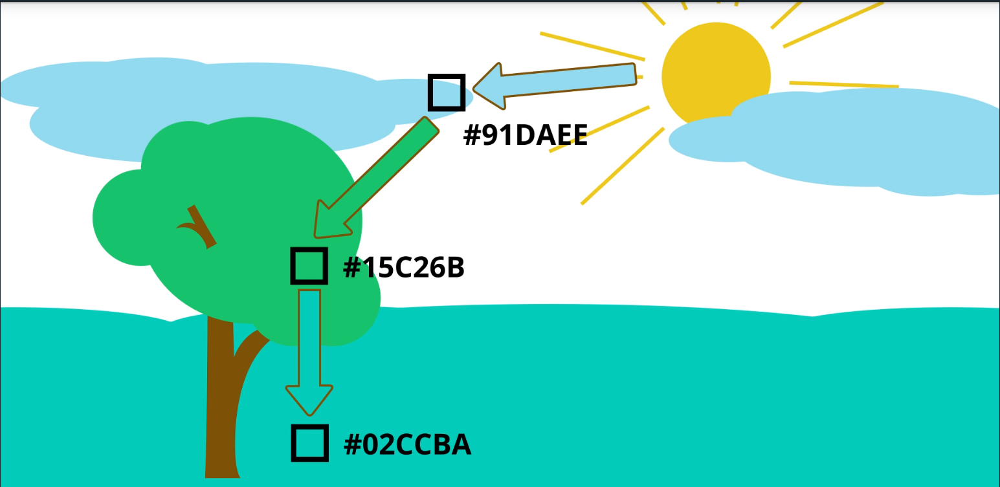

* Right click on the scene `Hierarchy`, the click `Light` -> `Directional Light`.
    * You can think of a directional light as a light that come from a far away object, something like the sun.
    * 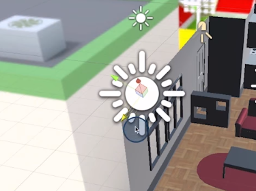
    * As a result, no matter where we move our directional light, you will see that the lighting stays the same. However, if we rotate our light, you can see that the lightning in our apartment changes. You can think of this in the way that lighting from a sunset is different from a high noon.
        * Both are coming from a distant object, in this case the sun, but the angle at which they hit our world is different, and that creates a different effect.

* Lets click on the `Direction Light` `Game Object`. You will notice it has a `Light` component associated to it.
    * Withing that component there is a option for `Type`.
        * 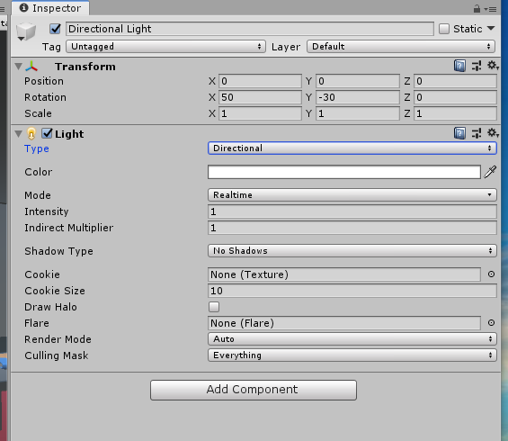
        * Spot
            * Like a point light a spotlight is dependent on its position but it is also dependent on its rotation.
            * 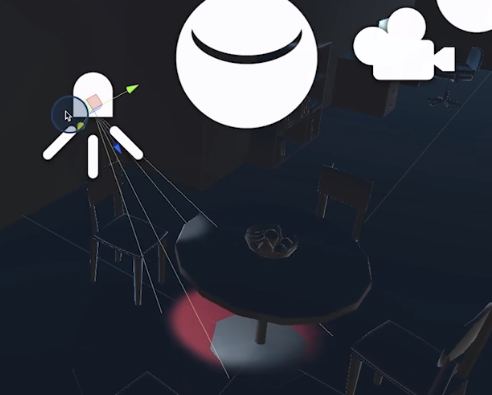
            * It's equivalent use in the real world is like a light house, flashlight, or stage spotlight, which is where the name comes from.
            * We can control its range as well as how wide the cone is by using `Spot Angle` and `Range`.
        * Directional
        * Point
            * If we use this option you will notice the `Scene` will turn black. That is because a `directional` light, unlike a `point` light, emits light from its current position, just like a light bulb. 
            * Just like a light bulb, a point light emits light in a sphere around it, which means the rotations don't affect it unlike a directional light.
            * 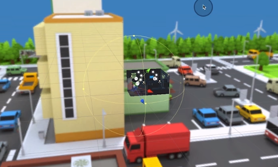
            * If we change the `Range` from 10 to 100, you will notice the apartment will get much brighter. This is because Unity fades the light intensity as you travel further away from a point light. If we increase the range that fading slows down.
        * Area (baked only)
            * Unity pre-calculates the illumination from these Lights before run time, and does not include them in any run-time lighting calculations. This means that there is no run-time overhead for baked Lights.
            * Know that an area like it will have to be baked, which means, we will need to do some computation before we run our experience in order to view this light.

* Generic Light Properties
    * `Color`: We can select any type of color we want. Picking a color adds a tint to our light, just like what you would see at a concert.
    * `Intensity`: This property allows us to control how bright or intense our light is. We can bring down the intensity value to zero for zero effect or we can max it out its highest value, which is eight, to supersaturate our apartment.
    * `Shadow`: To use them we first need to change our `Mode` to `Realtime`. Shadows are the real selling point about using light in Unity. Done properly, you can get some really nice effects like this.
        * 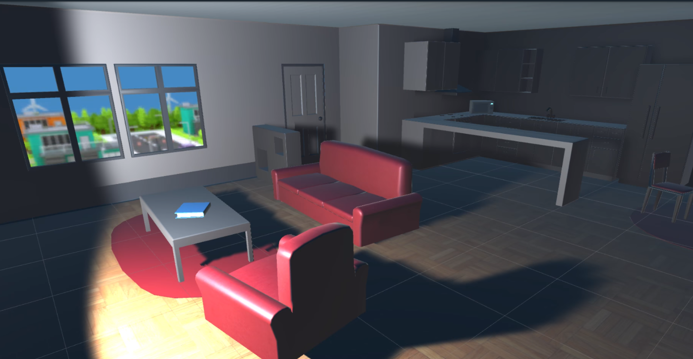
    * However, on mobile we should be careful about shadows as they are very computationally expensive when done incorrectly. 
    * To use shadows, you have three options. The first being no shadows which it defaults to. Second is hard shadows
        * Second is `Hard Shadows`, which are shadows with sharp edges. These shadows dont exist in the real world, but there are a lot more performant than their counterpart, `Soft Shadow`
        * `Soft Shadows` tend to look a lot more like shadows in the real world, but at runtime, they are a lot more impactful on performance. On mobile, we highly recommend not using shadows for realtime lights.

* `Render Mode` is a property that let's us tell Unity how important are lights. For now, let's just leave it as auto. With auto, Unity automatically determines if this light is important to our scene. If a light is not important and Unity realizes the app isn't maintaining frame rate, it can then turn off that light to save on performance. Its is better to have higher FPS app than one that makes people sick.

* `Culling Mask`: Choose which layers to render on. In a similar fashion, the culling masks let us choose which layers this light should effect. So, if we set our layer to nothing, our light basically does not even exist. Just like the camera, we can determine which objects can and cannot interact with the light.

* Click [here](https://docs.unity3d.com/Manual/class-Light.html) for more on lights.

* About `Baking`

    * It is a method to compute advanced lighting effects like indirect light bounces and realistic shadows
    * It allows us to create lightmap textures that can than be referenced at runtime, which is cheaper than calculating lighting at runtime
    * It requires that our lights and any object we want to **bake are static in the scene**

    * Since we now know that in order to bake lights for a game object it must be static, i.e. not move during gameplay, we should figure out how to tell Unity that a game object will not move.

    * To do that, we first select the game object in the scene hierarchy. In this case, we have selected the Apartment game object. Now, if you look at the top right of the Inspector, you will see a checkbox named Static:
        * 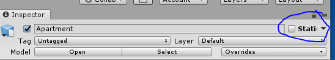
    
    * This is the property Unity uses to determine whether a game object is static or not.

    * As you can see, it is currently unchecked, so let’s enable it. When we do that, Unity asks if we want to apply this setting to all children. For this exercise, we don't need any of these child game objects to move, so let’s make them static as well by selecting the Yes, change children option:
        * 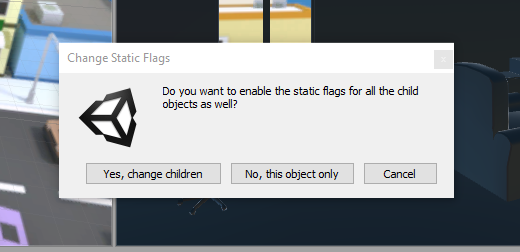
    
    * What we have actually done is enabled static not only for lighting but also for a lot of other properties. If we click the down arrow next to the Static checkbox, you will see that we can choose for which properties we want this game object to be static:
        * 
    
    * For example, there may be cases where you know a game object will be static for lighting purposes but not necessarily for navigation. You will usually tackle those on a case-by-case basis, but in general, if you know a game object is never going to move, then you can mark it static for everything.

    * Now, let’s move on to the lighting aspect. In case you didn't notice, we have actually already added in several area lights to the scene under the Lights game object. Feel free to tweak these as you desire.

    * Let's begin baking those lights. To do that, we go to Window > Rendering > Lighting > Settings. Let’s dock that next to the Inspector, and then at the bottom, we hit Generate Lighting:

    * Give it some time, as this is a fairly complex calculation that can take a few minutes. Once it is done, you will have have a nicely lit apartment!

    * Tip: Moving game objects in your scenes should never be marked static. Non-moving game objects should always be static.

* Lighting Modes

    * We just saw how we can bake lights for our scene game objects, but how do we set up our lights to choose whether or not they are baked?

    * On any light, except the Area Light, we have the option to set it's Mode. This mode property can be set to Realtime, Mixed, or Baked:

    * 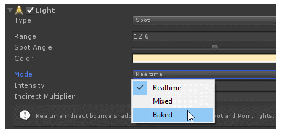

    * As you might imagine, if we have a light that is set to Realtime, it will not be baked. Likewise, if you set a light to be Baked, it will be baked but not have any realtime effects.

    * Based on those two descriptions, you might be able to infer what Mixed mode is? In Mixed mode, Unity will both bake the light and use the light for realtime effects. The specific effects of the mixed light will vary depending on the Mixed Lighting Mode settings which we will discuss towards the end of this lesson.

* Introducing the Lighting Panel

    * In order to bake our scene we needed to open up the lighting window. This window allows us to control a lot of settings that will make our scene optimized and really come to life.

    * At the top, it is divided into three tabs: Object, Scene, and Lightmaps.

    * **First up, we have the scene tab**

        * This tab really lets us control the settings of the light in our scene. It broken into 6 sections: Environment Lighting, Precomputer Realtime GI, Baked GI, General GI, Fog, and Other Settings. We will take a closer look at this tab over the next few videos.

        * 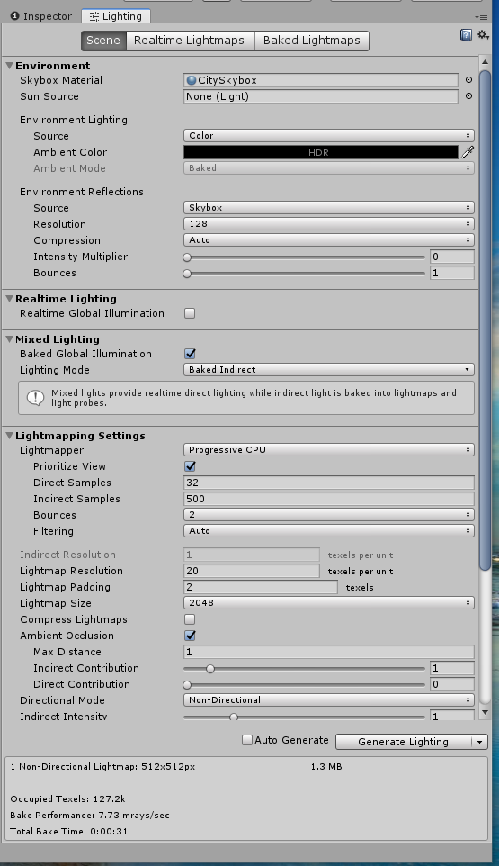

    * Next up, we have global maps

        * Once we bake a scene, we can come to this tab to check out what our light maps actually look like.

        * 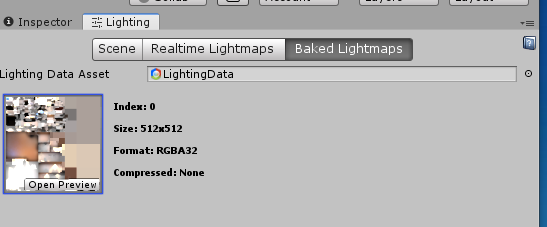

        * Here you can see the files and textures were actually created. It is pretty hard to glean information from the image, but this tab is useful for seeing how much data is being stored tuning your parameters to optimize the number or size of textures.
    
    * Last up, we have object maps

        * In a similar fashion to the inspector, this tab allows us to look at the specific properties of a selected Game Object. By using the drop down, you are able to select from a variety of properties that would affect the lighting of our objects:

            * Albedo
            * Emissive
            * Realtime Intensity
            * Realtime Direction
            * Realtime Charting
            * Baked Intensity
            * Baked Direction
            * Baked Charting
            * Baked Shadowmask

        * 

        * By default, the dropdown selects Albedo. Click on the Book_Shelf in the inspector. Then go to the Object maps tab and select Baked Charting.

        * 

        * When you do so, you will see the map that the Book_Shelf is in. An if you press 'F' while your mouse cursor is over the the map, you will zoom into the specific area that relates to the Book_Shelf. You can also use your Scroll Wheel to zoom in and out of the map.

        * Next up, we will be diving A LOT deeper into the Scene view and how we can use it to optimize the lighting in our scene. But before moving on, feel free to explore other Game Objects and take a look at what their light maps look like. Now's a great time to appreciate the fact that Unity has this built in and you don't have to code it yourself :)
    
* Lighting from the Sky

    * Now that we have a general overview of the Lighting window, let’s dive deep into Scene tab.

    * Starting from the top, we have the Environment Lighting section.

    * 

    * Remember the Skybox from last lesson? In that lesson, we added a Skybox to a component on our Camera. But that resulted in us not being able to see our Skybox in the Scene view. If we want to see it in the scene view as the default Skybox for our Cameras, we can actually set a Skybox in this section. Let’s set the Skybox to the one we created last lesson by dragging and dropping it onto the tab.

    * 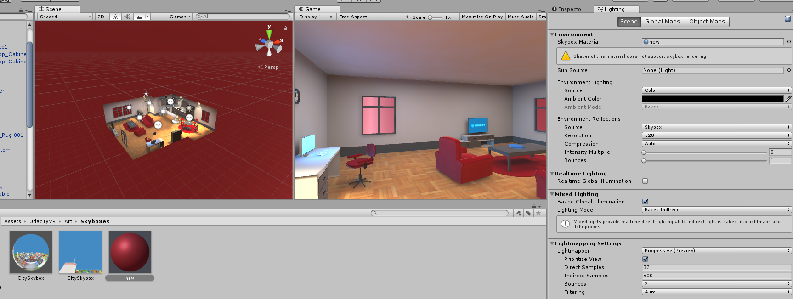

    If you don't see a red tinted skybox in the Scene View, it may be because either you don't have a directional light in the scene OR the rotation of your directional light is incorrect. You can easily fix this by creating a directional light and rotating it.

    * 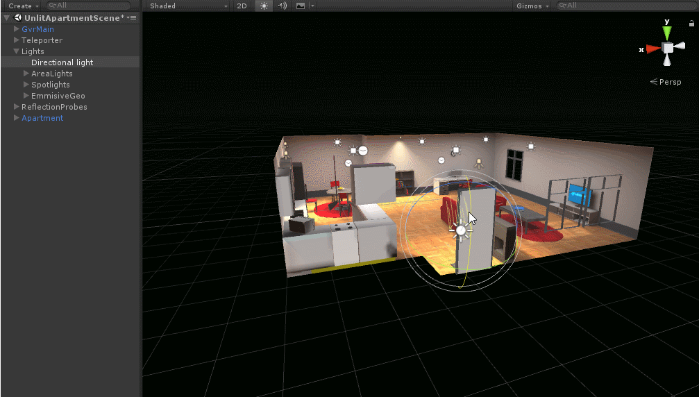 
        * Awesome, we have our Skybox set up properly!!

    * Now, moving to the next property in the Lighting panel, we have Ambient light.

        * Unlike any light we have discussed before, Ambient light is a light source that affects all objects in the scene at a fixed intensity and from all directions. Basically, think of it as a a 360 degree directional light. In the image below from the Unity documentation, the same objects are rendered except the left image has no lighting and the right has just ambient lighting.

        *  

        * We can set Ambient Lighting to be sampled from the Skybox, a gradient, or a simple color. For the purposes of our apartment, we will be using a color. Once we select Color, we can then change the Ambient Color property. Since most of the lighting will come from our area lights, we will choose to set the Ambient color to black, which is the same as no ambient light.
    
    * The last core component of Environment Lighting is Reflections.

        * In the real world, light bounces off a bunch of object, but calculating that in real-time is an expensive process. Unity has a system in place for calculating reflections for use with shiny objects and in the Environment tab allows us to specify how reflections are calculated from the sky. Since our apartment is indoors, we don’t want to be affected by the sky, and thus want to turn off Environment Reflections.

        * To do that, simply make sure that our Reflection Source is set to Custom and its Cubemap is set to none.

        *  

        * If you do make a scene that you want Reflections for, make sure to read [here for more information](https://unity3d.com/learn/tutorials/topics/graphics/reflections).
