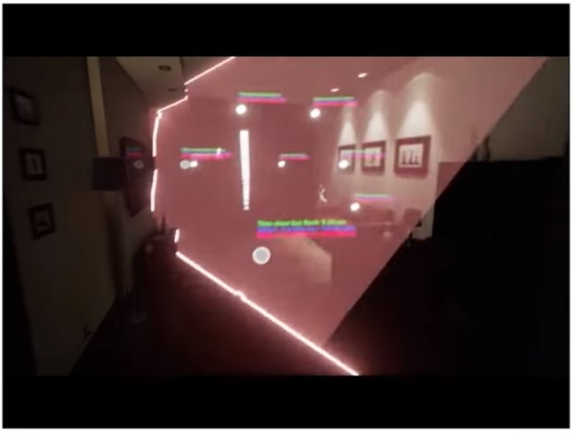

# VR Foundation 

## Introduction to Virtual Reality 

### Lesson 2: What is VR?

* The VR lenses are designed to make it possible for you to focus on a screen that is extremely near your face.
    * They will also magnify the image from the phone display 
    * Each manufacture needs to come up with a lense that makes the best tradeoff: field of view, focal length, comfort, optical distortion, and cost

* **Low persistence**: Shows just part of the image to the user (do not show the full image)
    * It looks like one of those old CRT TVs where you can see the image being generated in real time
    * We only show the slices because it reduces motion blur (clear image)
        * That hides the pixels while they change color
        * Keeps the image clear

* For tracking, all modern VR headsets uses a technology called Inertial Measurement Units (IMU).
    * Enables hi speed rotation tracking
    * It can't tell where an object is in space, but it can tell when an object rotates
    * In order to track the users position, some VRs sets uses cameras, lasers, magnetic fields, etc..
        * No universally acceptable technic

* What causes discomfort while using a VR headset?
    * Miss match between your body internal sense of motion, and the data your brain receives from your visual system
        * What you see don't line up with what your body feels

* The origin of VR comes from 3D displays
    * 1838: Sir Charles Wheatstone 
        * To images being reflected at 45 degrees
    * 1968: Ivan Sutherland 
        * Track users head motion and overlay synthetic 3d stereoscopic computer generated graphics
    * 2012: Oculus Rift

* Lesson Review
    * What is virtual reality?
        * Virtual reality is the creation of a synthetic, believable virtual world that is made possible by hardware and software.
    * What hardware is needed for virtual reality to work?
        * Hardware components include two lenses, a display panel or two and some sort of tracking hardware.
        * Lenses
            * Lenses help us focus on the displays that are really close to our eyes. They magnify the image to ensure that we can see everything.
        * Display Panels
            * Display panels are the component that will actually display the image that we’re going to see. Some hardware, like the Oculus Rift, Oculus Go, or HTC Vive, use embedded display panels. The display panels are included in the headset. Other hardware uses a phone as the display panels. For example, Google Cardboard, Google Daydream, and GearVR use a phone to do display the images. Display panels need to have a very high resolution and support low persistence. In order for a resolution to be as good as a photo, a display panel in a headset would need to have 16,000 by 16,000 pixels. For comparison, the HTC Vive has a resolution of 1080x1200. We have a long way to go! The low persistence is needed because this will help ensure we see clear visuals when rotating our heads in VR. It prevents what’s called “motion blur”. Since OLED pixels don’t change color fast enough, low persistence updates a small portion of an image at any given time, making the visuals clear as we turn in VR.
        * Tracking
            * VR requires some sort of tracking in order to work. Inertial Measurement Units (IMUs) are the chips that are used for tracking rotation. Google Cardboard, for example, would use IMUs to track our rotation as we move the headset around. The only drawback of this type of tracking is that IMUs don’t track position. To track our position in the space, we must use other techniques. Some headsets use cameras, lasers, or magnetic fields to track our position.
        * What is simulator sickness?
            * One of the most common challenges of developing for VR is called “simulator sickness” (or sim sickness). This is where someone gets sick (dizzy, queasy, or headaches) from a VR experience. Sim sickness is caused because there’s a mismatch between the body’s internal sense of motion and what we see.
        * How did we get to where we are with VR?
            * A very brief timeline: 1838 → The Stereoscope is invented by Sir Charles Wheatstone. This is our first foray into 3D graphics.
                * 1968 → The Sword of Damocles is invented by Ivan Sutherland. His invention tracked user head motion and overlayed vision with synthetic computer generated graphics of primitive 3D object wireframes.
                * 1990s → VR was first promoted to the general public but the devices didn’t live up to expectations.
                * 2012 → Oculus Rift Kickstarter is launched and backed. Oculus would later be bought by Facebook for $2 billion.
                * 2014 → Google Cardboard released.
                * 2016 → Google Daydream was announced.

### Lesson 3: Platforms and Paradigms?

* The biggest difference between Mobile vs Desktop VR is DOF
    * DOF is short for Degrees of Freedom 
        * How accurately a VR system can track you
        * For a VR headset, it is the difference from knowing where are you looking and where are you looking and located in the room
    * 3 DOF means your head can be tracked when:
        * It **rotates** along the X, Y and Z axis    
        * To detect rotation a simple sensor called IMU (Inertial Measurement Unit) is used
            * Combines the information from an accelerometer, magnetometer and gyroscope. Basically it is using gravity and the earth magnetic field to constantly infer where it is pointing.
            * 
        * This can either come from the phone of the headset it self
    * 6 DOF
        * Can also be tracked when it **moves along** the X, Y and Z axis  
        * That means you are tracker around the room, and not only statically in the same position
        * Position tracking mostly uses Optic technics 
        * 
        * Oculus Rift 
            * 
            * Uses a tracking system called **Constellation**
            * The headset contains a great number of infra red LEDs. Each LED is blinking super fast in a specific pattern 
                * 
            * Also has a separate camera that you place in your desk. The camera captures the light patterns and a computer program builds up a model of the light positions
                * 
                * That then tries to fit a 3D model of the rift onto the 2d model of the camera
                    * * 
                * Based on this 3d model, and measurements from an internal IMU it calculates your head position
                * This model is cheap and has decent results, and that is why Oculus is doing it
        * HTC Vive (HTC + Valve)
            * 
            * Uses a tracking system called **Light House**
            * Unlike the Oculus Rift, it uses infra red laser
                * It works by measuring the time it takes for a laser to swipe horizontally and vertically across a fast photo sensor.
                * 
                * 
                    * It is a similar principal to how ships navigates using time measurements between light house flashes (hence the name light house)
                * 
                    *  Both the Vive head set and controllers are covered with little circular indentions for the photo sensors
                * 
                    * A Vive base station is constantly swiping the room with a laser that hits the photo sensors. The swipe times are used to determine their positions in space. It uses this data and combines with readings from a embedded IMU to determine where your head and hands are located

* Mobile vs Desktop VR
    * Mobile VR uses the phones IMU.
        * This only leads us to 3DOF (only head rotation)
    * No wires needed
    * Less power full in terms of graphical performance
    * Desktop VR gets full 6 DOF tracking
        * Long cables from the headset to the PC
        * More computing power (better visual quality)
    * Desktop VR generally have hand controllers

* VR Development Platforms
    * Their are two primary ways of rendering 3d environments 
        * Write code
        * Use a graphical based environment 
        * Or a combination of both
    * Unity Game Engine
        * Makes it easier to develop games
        * The engine provides
            * 3D rendering 
            * Physics
            * Sounds
            * Scripting 
            * Animation
            * Asset Management 
            * And more...
    * Other game engines
        * Unreal Engine
        * Cryengine
        * Lumberyard
        * etc...
    * Could also go native with OpenGL, Microsoft DirectX, etc..
    * WebVR: Not ready, but good prospect

* Lesson Review
    * What is DoF?
        * DoF stands for degrees of freedom and deals with how accurately the VR system can track you.
    * What is the difference between 3DoF and 6DoF?
        * 3DoF tracking will track how the headset is rotated, so it will know where we’re looking. Most mobile VR platforms use 3DoF tracking. A 6DoF headset will track rotation PLUS position. It will know where we’re looking and where we are in the world. This is how high end VR systems, like the HTC Vive and Oculus Rift, allow you to move around the room.
    * How does 3DoF tracking track our rotation?
        * Inertial Measurement Units (IMUs) are used to track the rotation. IMUs use a gyroscope, accelerometer and a magnetometer to detect rotations. All modern 3DoF tracking uses an IMU.
    * How does 6DoF tracking work?
        * There are many different ways to accomplish 6DoF tracking.
        * The Oculus Rift uses a large number of LEDs and external cameras that build a model and then it tries to fit a 3D model of the headset with the 2D model it sees of the camera. Then it uses information from an internal IMU to calculate head position.
        * The HTC Vive uses infrared lasers to measure the time it takes to sweep vertically and horizontally across a photo sensor. It uses the data it gets and an internal IMU to determine where your head and hands are located.
    * What are the key differences between mobile and desktop VR?
        * Mobile VR uses IMU tracking, so it only has 3DoF tracking. It can only track your head’s rotation - not it’s position. It’s also “untethered”, meaning that there’s no wires connecting your headset to a computer. You can use it anywhere. It has less powerful graphics and is powered by a battery.
        * Desktop VR uses 6DoF tracking and is typically tethered. It’s plugged into a computer and uses the computer to do the graphics work and to get its power. The graphics are generally more impressive. Most desktop VR headsets also come with hand controllers that allow for more interactivity and a more immersive experience.
    * How can we develop for VR?
        * Generally, developing for VR requires writing some code, using an editor, or a combination of both. We’ll be doing both over the course of this program.
        * For our editor, we’ll be using Unity, a popular game engine. A game engine is a software development framework that makes it easier to develop games. Game engines typically provide 3D rendering, physics, sound, scripting, animation, asset management, and more. This will enable us to develop quickly and learn.
        * Other popular game engines are: Unreal Engine, Cryengine, Lumberyard and more.
        * You can also use native development tools like OpenGL and Microsoft DirectX. These options offer more flexibility, but typically have much longer development times and writing more code.
        * WebVR is also an option. However, it’s not yet good enough for production apps.

### Lesson 4: Hello World?

* Create a new project using Unity

* In the center of the screen you have the `Scene`
    * If you right click and hold inside the `Scene`, you can navigate it by using a,s,d,w
    * 
* On the left side you have Hierarchy 
    * You can see a list of `Game Objects` we have added to our scene
        * A `Game Object` is Unity`s way of representing anything that can affect our scene
            * A light
            * A cube
            * A complex character
            * Main camera
        * 
* Each Game Object can have many `Components` (which is the window in the right)
    * 
    * Each `Component` has a list of properties that we can change. For example, the `Transform` component can be manipulated by using the buttons on the top left corner.
        * 
        * 
* We can notice our changes to the `Transform` component not only reflect in the `Scene` it self, but also on something called the `Game` view.
    * 
        * That is the view the users will see when you finally publish your app 
    * You can drag the `Game` view right next to the `Scene` view
        *  
* Unity also provides a set of layouts that users can use (check the top right corner). We will stick with the `Default` layout for now
    *  
* On the bottom of the screen we can see the `Project` option. This is the place where we can access any file we save or import to our project.
    * This includes code we write, 3d models we build, or full out scenes.
    *  
    * Lets save our current scene inside the `Assets` folder
        *   
* Recommended Reading
    * [Unity Manual: Scene View navigation](https://docs.unity3d.com/Manual/SceneViewNavigation.html)
    * [Unity Manual: Customizing Your Workspace](https://docs.unity3d.com/Manual/CustomizingYourWorkspace.html)
* Additional Reading
    * [Unity Manual: The Project Window](https://docs.unity3d.com/Manual/ProjectView.html)
    * [Unity Manual: The Scene View](https://docs.unity3d.com/Manual/UsingTheSceneView.html)
    * [Unity Manual: The Game view](https://docs.unity3d.com/Manual/GameView.html)
    * [Unity Manual: The Hierarchy window](https://docs.unity3d.com/Manual/Hierarchy.html)
    * [Unity Manual: The Inspector window](https://docs.unity3d.com/Manual/UsingTheInspector.html)
* Extra notes based on Readings
    * **Gizmo** or **Scene Gizmo**: A graphic overlay associated with a `GameObject` in a `Scene`, and displayed in the `Scene View`. Built-in scene tools such as the move tool are Gizmos, and you can create custom Gizmos using textures or scripting. Some Gizmos are only drawn when the GameObject is selected, while other Gizmos are drawn by the Editor regardless of which GameObjects are selected

## VR Scenes and Objects

## Lesson 2: Game Objects

* Primitives
    * Cubes
    * Spheres 
    * Cylinders
    * Cones 
    * Planes

* To create a primitive you click on `GameObject` -> `3D Object` on the top menu. 
*  

* Unity does support importing 3D models from other application. However, it is not a 3D modelling/texturing/character rigging tool it self. This makes it way easier to learn 
    * Rigging a 3D model creates a skeleton or a frame for that model. By rigging a 3D model you can make it move around and perform different actions. Otherwise, the model would be static and remain in the position that it was when the animator created it.
    * Unity is a master at assembling 3D Scenes
    * Maya, 3D Studio, Blender, etc..
        * We will use those tools for 3D modeling

*  

* Transform Hierarchie
    * 
    * If you drag one `GameObject` inside another one, this will generate a unified transform. Whenever you change the scale, position or rotation of the parent object, all its chields will update

    * Unity uses matrices to quickly process the parent/child transform hierarchies. This is a really good idea because matrix operations are extremely fast on modern computers.

* Lesson Review

    * What are VR scenes made of?
        * Everything you see in a VR scene is made of something called meshes. Meshes are made of triangles which are made of points. We use triangles to represent 3D objects because it’s fast, easy, and computers are optimized for them.
            * A polygon mesh is a collection of vertices, edges and faces that defines the shape of a polyhedral object in 3D computer graphics and solid modeling.
        * Points / Vertices 
        * Edges
        * Connect the Points to the Edges using a straight line in order to generate a polygon / poly (triangles in the case of Unity)
            * Polygons are 2-dimensional shapes. They are made of **straight lines**, and the shape is "closed" (all the lines connect up).
        * Connect the Triangles and you will have a Mesh/Polygonal Mesh
    * What are Primitives and how can I make some in Unity?
        * **Primitives are very basic 3D meshes**. Some examples of them include cubes, planes, spheres, and cylinders. There are a couple of different ways to make a primitive object in Unity. One way is to go to GameObject > 3D Object and then select the object you wish to create.
    * Does Unity support creating more complicated models?
        * Unity focuses on rendering 3D scenes and does NOT support creating more complex models. You’d have to use a separate specialized program like Blender or Maya to create complex models. You can also get 3D models online (from a site like Poly) or through the Unity Asset store.
    * How can I bring a 3D object into my scene?
        * To get the model from your computer into Unity, you can go to Assets > Import New Asset and navigate to where the model is on your computer. Once the model is in your project. Drag the 3D object from the Project window into the hierarchy. Use the move tool arrows to position the object where you’d like it to be.
    * What are transforms?
        * Every `GameObject` in Unity has a Transform component. This is the component that tracks the object’s position, rotation, and scale. You can change the properties by changing the values in the Inspector or by using the move, rotate, or scale tools in the upper left corner of Unity.
    * What are transform hierarchies and how can I create one?

## Lesson 3: Materials

* Materials are good for coloring, shading and texture

* To create a `Material` navigate to the project folder, more specifically to the `Assets` folder.
    * After that, click `Create` on the top left corner, and then select `Material`

* This `Material` represents a **shader**
    Shader: the production of appropriate levels of light, darkness, and color within an image
    * `Albedo` parameter defines how light changes when it gets reflected by a surface
        * Lets say white light hits my shirt and then is reflected blue. That is the `Albedo` of the shirt material
        * The `Albedo` is the materials main color

* `Textures` are images that get stretched around `Meshes`
    * They are used to adjust color, transparency, depth, shininess, metalness, light emission and many more
    * 

* To create a `Shader` click `Create`->`Shader`->`Standard Surface Shader`
    * We can change the `Albedo` property of the `Shader` to be always green: `o.Albedo = float3(0, 1, 0);`
    * After that, we can create a new `Material` and apply the `Shader`
    * 
        * `float3(0, abs(sin(_Time.z)), 0);`
            * `_Time.z`: number of seconds passed after you pressed play
            * `sin`: will give us a number from -1 and 1
            * `abs`: from 1 to 0
    
    * Unity’s Standard Shader attempts to light objects in a physically accurate way. This technique is called **Physically-Based Rendering** or PBR for short. Instead of defining how an object looks in one lighting environment, you specify the properties of the object, for example, how metal or plastic it is.

    * Then, the shader computes its shading based on those factors. In practice, this works incredibly well to produce realistic 3D objects across a variety of lighting conditions. The big problem is that it is often computationally expensive.

    * For mobile VR, it is unlikely we will be able to hit our performance targets if we use the Standard Shader. So, we will be using simpler and less computationally expensive shaders for this course.

    * A super fast shader is the `Mobile` -> `Unlit`, but it is not attractive
        * Another option is to use `Mobile` -> `Diffuse`, it will look more like the standard shader
            * This is much much faster compared to the `Standard Shader`
        * 

* Lesson Review

    * What are materials?
        * Materials are what we use to color and shade our objects. They consist of a shader and its settings. Without them, we wouldn’t be able to see objects in our scene at all!
    
    * How can I create and assign materials to an object?
        * To create a material, go to the Project window and click Create > Material. There are a couple different ways you can assign a material to an object. Find the material in the Project window and click and drag the material onto an object in the Scene. Click on an object in the Hierarchy, so you can see the details in the inspector. Click and drag the material and drop it in the inspector.
    
    * What are textures and how can we assign them to an object.
        * Textures are images that get stretched around meshes. They can adjust color, transparency, depth, shininess, metalness, light emission, etc. To assign a texture to an object, find the object’s material in the Project window and click on it, so you can see its properties in the Inspector window. Search for your image in the Project window. Click and drag the image into the small box to the left of the “Albedo” setting in the object’s material.

    * What are shaders?
        * Shaders are written in High Level Shader Language (HLSL). Shaders are essentially the code behind how an object is rendered.
        
        * For mobile VR, we’ll want to use simple shaders because the Standard Unity shaders will be too computationally expensive. To change the shader type of a material, click on the material in the Project window. In the Inspector, toward the top, you’ll see a dropdown for Shader.
    
    * What are some simple shaders?
        * Mobile > Unlit (Supports Lightmap) - This super fast shader supports lightmaps, but doesn’t get any realtime lighting.
        * Mobile > Diffuse - This is a fast shader, that does get some lighting information. The main difference between this shader and the standard shader, is that this one is much faster.
    
    * What makes up a model?
        * Models are made up of materials, textures and meshes.

## Lesson 4: Animations

* Click on `Window` -> `Animation` -> `Animation` to open the animation screen (you can drag it if you want)
* In order to create an animation, you first need to select an object in the `Hierarchy`
* Once we do that, the `Animation` window will turn to a timeline also known as the `Dopesheet`.
    * On the left we can click the `Add Property` button and we can animate any of this properties (example: the transform component associated to the object)
    * 
* You can also see some diamonds on 0 seconds and 1 second. These diamonds represent keyframes
    *   
        * Key frames are points in our animation where we can update our properties
        * We can create new `Keyframes` by clicking anywhere in the timeline.
    * By dragging the time line (white line), you can change the property value associated to the `Keyframe`.
    * How is the animation build based on those key frames (example: 360 rotation)
        * Interpolation, Smoothing and Averaging
            * By definition, **interpolation is the process of constructing new data points within the range of the known data points.**
            * In our case, the known data points are the keyframes we specify. The new data points are calculated by averaging and smoothing values in between.
            * In VR and computer graphics in general, interpolation is used quite regularly to speed up the process of creating beautiful scenes.
    * 
        * If you click the `Curve` button on the bottom of the screen, you will be able to see the interpolation that is done to generate a new `Rotation.z` value.  
        * Right now this graph has a curve, but we can make it linear by clicking on both ends of the line and selecting `Both Tangents` -> `Linear`
        * To learn more about the Animation Curves, check this link [here](https://docs.unity3d.com/Manual/animeditor-AnimationCurves.html)
    * 
        * By clicking on the animation, we can create another animation associated to this `Game Object`
    * Inside the `Animations` folder you will notice a `Clock_Handle_Seconds`. As you can probably guess from the filename Clock_Handle_Seconds and its extension .controller, that file controls all the animations associated with the Clock_Handle_Seconds.
        * Both our animations clips that we created are accessible through the controller and it controls several properties of the animations, such as when they are played, how to transition between animations, and how to blend animations together, to name a few.
    * 
        * To move around we can do `Alt + Left Click`
        * Each block is called a `State` which are all part of a gigantic `State Machine`
        * 
            * A `State Machine` is a system that connects many `States` together via transitions.
        * At any given point, our clock hand can be in one state, and that state represents which animation we are currently doing.
        * The `Entry` and `Exit` states are special `States` that represent when our machine starts up and ends.
        * The `Any State` is a special `State` that represent all animation states.
        * In order to transition to a different state, just right click on a `State` box and select `Make transition`
        * Read more  about `Animation transitions` [here](https://docs.unity3d.com/Manual/class-Transition.html)
    * To control our animations, we will also use `Parameters`
        * 
            * We will use a `Trigger`, a bool that resets back to False immediately after transition occurred
            * 
            * We can un-check `Has exit time` to remove the transition between the two `States`
    * To control animations without the animation window, we can use C# scripts.
        * We can drag an drop a script as a `Game Object` `Component`.
        * Example of a animator script code
            * ```csharp
                using UnityEngine;
                using System.Collections;

                /// <summary>
                /// The TriggerAnimation class activates a transition whenever the Cardboard button is pressed (or the screen touched).
                /// </summary>
                public class TriggerAnimation : MonoBehaviour
                {
                    [Tooltip ("The name of the Animator trigger parameter")]
                    public string animationName;
                    [Tooltip ("The Animator component on this gameobject")]
                    public Animator stateMachine;

                    void Update ()
                    {
                        // If the player pressed the cardboard button (or touched the screen), set the trigger parameter to active (until it has been used in a transition)
                        if (Input.GetMouseButtonDown (0)) {
                            stateMachine.SetTrigger (animationName);
                        }
                    }
                }
                ```

* Lesson Review

    * How can I create an animation?
        * Select an object in the hierarchy. In the Animation window, click Create. Choose a name for your animation and save it to an appropriate folder in your project. Click Add Property and select a property you want to animate.
        * The timeline (also known as a dopesheet) contains all of the frames of our animations. Keyframes are indicated by diamond shapes in the timeline and are key points in our animation where we can update properties. To create new keyframes, double click on the timeline. You only need to define a few keyframes to create smooth animations. The points in between keyframes are created using interpolation, averaging and smoothing.
    
    * What is the difference between the Play button in the Animation window and the Play button at the top of our Unity editor?
        * Clicking the Play button in the Animation window, runs only the animation. The Play button in the top of the editor will play our entire scene.
    
    * Our animations might not loop seamlessly. It tends to lag a bit at the start or end of our animation. How can we fix that?
        * This can happen if the tangents of our animation are not set to be linear. To resolve this, in the animation window, there are two tabs. One for “Dopesheet”, which is the one that we start on by default. The other is “Curves”. Click on Curves and you’ll see a line that represents our animation. Click on the first keyframe, and set “Both Tangents” to “Linear”. Do this for the last keyframe as well.
        * Tip: If you’re working with a larger animation with more keyframes, you may want to do this with all your keyframes.
    
    * What are animation controllers?
        * Animation controllers are the files that controls all the animations associated with a given object. These controllers control properties of the animations like when an animation is played, how to transition between animations and blending animations together.
    
    * What is the difference between the Animator window and the Animation window?
        * The Animator window is what controls all our animations for a given object. The Animation window lets us see and modify a specific, individual animation.
    
    * What is the Mechanim State Machine?
        * In the Animator window, you’ll see several boxes. By default, an animator controller has Entry, Any State, and Exit states. The Entry and Exit states are used for when the object starts up and ends, respectively. The Any State is a special state that represents all other animation states. There will also be one for each animation on the object. The Mechanim state machine is what connects the various states together and handles transitions between animations, or “states”. At any point, our object can only be in one state and playing one animation.
    
    * How do I transition between states in the Animator (Mechanim State Machine)?
        * Right click on a state and select Make Transition. Then click on another state. This will create a transition (represented by an arrow) from one state to another.
    
    * How do I control states in the Animator?
        * e use parameters to control the various states in our Animator. To create a parameter, click on the Parameter tab in the Animator window. Click the plus icon, then select the type of parameter you’d like to create. There are options for floats (decimals), int (whole numbers), bool (true or false), and trigger (a bool that resets back to false immediately after the transition occurred).
    
    * I have my parameter setup, but how do I actually use it?
        * In the Animator window, click on the transition (arrow) you want to use the parameter. Then in the Inspector window, you will add it to the “Conditions” by clicking the plus icon.
    
    * I want my transitions to happen immediately. How can I adjust when my parameters take effect?
        * By default, Unity assumes that an animation should complete before transitioning to another state or animation. This is a concept called “Exit Time”. To change this, click on the transition arrow in the Animator window. Uncheck “Has Exit Time”.
    
    * Tip: If you’re still noticing a little jump when shifting between states, it’s likely due to the animation clips being of different lengths. To avoid that jump, make your animations the same length.

    * Note: This lesson didn’t show you how to change the animations with your own scripts. That will be included in an upcoming lesson.