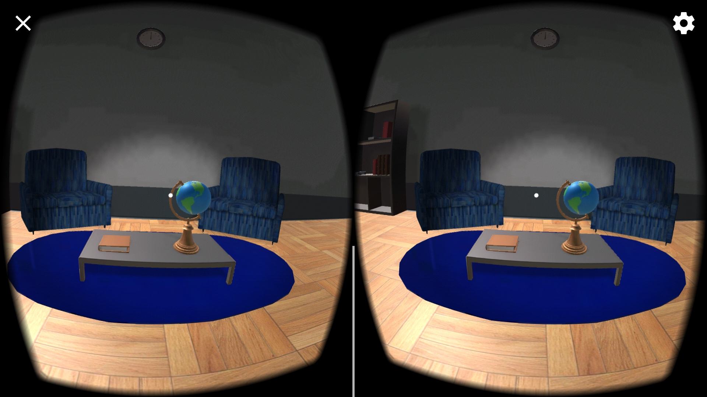

# Build an Apartment
Starter project for the Udacity [VR Developer Nanodegree](http://udacity.com/vr) program.

- Course: VR Scenes & Objects
- Project: Build an Apartment

# About
This project was built by Daniel Marchena Parreira and this app was made for phones running on Android Kitkat or higher. The goal of this project was to learn how to work with Polygonal Meshes, Materials, Textures, Shaders, Lights, Cameras, Animations and other features of the Unity Engine. 

# Time to develop

* How long it took to complete the project
    * It took me about 5 hours to develop this task.

* One thing you liked about the project
    * I truly exercised all the learned concepts 

* One thing that was particularly challenging about the project
    * The animation was a bit tricky, but I found this resource [here](https://forum.unity.com/threads/start-animation-on-mouse-click.442023/) and it helped me get the desired result. I also explored a bit with the `OnMouseDown` method inside my script, but I noticed it does not work on Android, it is probably a PC/Mac only method.

# Packages used

* Besides packages included with the boilerplate, I've imported a third party `Texture` called `Original Wood Texture`, you can find more about it by clicking [here](https://assetstore.unity.com/packages/2d/textures-materials/wood/15-original-wood-texture-71286)

# Screenshot on Samsung S7

 

### Versions Used
- [Unity LTS Release 2017.4.15](https://unity3d.com/unity/qa/lts-releases?version=2017.4)
- [GVR SDK for Unity v1.170.0](https://github.com/googlevr/gvr-unity-sdk/releases/tag/v1.170.0)

### Directory Structure
- The Unity project is the child directory of the repository and named according to the associated lesson.
- The Unity project is 'cleaned' and includes the `Assets` folder, the `ProjectSettings` folder, and the `UnityPackageManager` folder.

### GVR SDK for Unity
- `GoogleVR` > `Demos` is not included.
- `GoogleVR` > `GVRVideoPlayer.unitypackage` is included.
- Scripts applicable to the course have been updated to reflect Unity's API change from `UnityEngine.VR` to `UnityEngine.XR`.

>**Note:** If for any reason you remove and re-import GVR SDK for Unity v1.170.0, make sure you accept any API update pop-up prompts triggered by Unity. Alternatively, you can manually run the API updater (Unity menu `Assets` > `Run API Updater...`) after the import has completed.

### Related Repositories
- [VR Scenes and Objects - Game Objects](https://github.com/udacity/VR-Scenes-and-Objects_Game-Objects/releases)
- [VR Scenes and Objects - Animations](https://github.com/udacity/VR-Scenes-and-Objects_Animations/releases)
- [VR Scenes and Objects - Cameras](https://github.com/udacity/VR-Scenes-and-Objects_Cameras/releases)
- [VR Scenes and Objects - Lights](https://github.com/udacity/VR-Scenes-and-Objects_Lights/releases)
- VR Scenes and Objects - Build an Apartment
