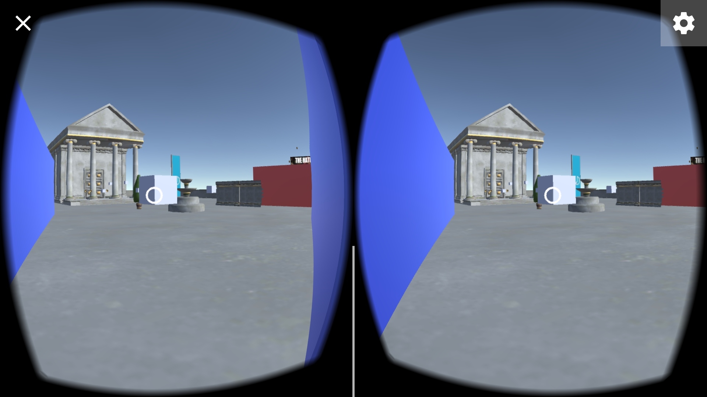

# A Maze
Starter project for the Udacity [VR Developer Nanodegree](http://udacity.com/vr) program.

- Course: VR Software Development
- Project: A Maze

# About
This project was built by Daniel Marchena Parreira and it was made for phones running on Android Kitkat or higher. The goal of this project was to learn how to work with C# Scripts, coding animations, Way points, RayCasting and other features of the Unity Engine. 

* Main Scene can be found in `/UdacityVR/Scenes/Main`

### Screenshot

 

### Versions Used
- [Unity LTS Release 2017.4.15](https://unity3d.com/unity/qa/lts-releases?version=2017.4)
- [GVR SDK for Unity v1.170.0](https://github.com/googlevr/gvr-unity-sdk/releases/tag/v1.170.0)

### Additional resources

* Demon prefab: https://assetstore.unity.com/packages/3d/characters/humanoids/toon-demon-127659

### About the Starter Project
The included starter project represents a new Unity project where the following have been done:
- All assets needed to complete the project according to the project rubric have been imported.
- The imported models have been placed in the scene and organized in the scene hierarchy.
- Colliders have been added to the `Coin`, `Key`, `Left_Door`, `Right_Door`, and `The_Temple` game objects, and to the `Maze` game object's child game objects.

### Related Repositories
- [VR Software Development - Creating Scripts](https://github.com/udacity/VR-Software-Development_Creating-Scripts/releases)
- [VR Software Development - Controlling Objects Using Code](https://github.com/udacity/VR-Software-Development_Controlling-Objects-Using-Code/releases)
- [VR Software Development - VR Interaction](https://github.com/udacity/VR-Software-Development_VR-Interaction/releases)
- [VR Software Development - Programming Animations](https://github.com/udacity/VR-Software-Development_Programming-Animations/releases)
- [VR Software Development - Physics and Audio](https://github.com/udacity/VR-Software-Development_Physics-and-Audio/releases)
- [VR Software Development - Advanced VR Scripting](https://github.com/udacity/VR-Software-Development_Advanced-VR-Scripting/releases)
- VR Software Development - A Maze
